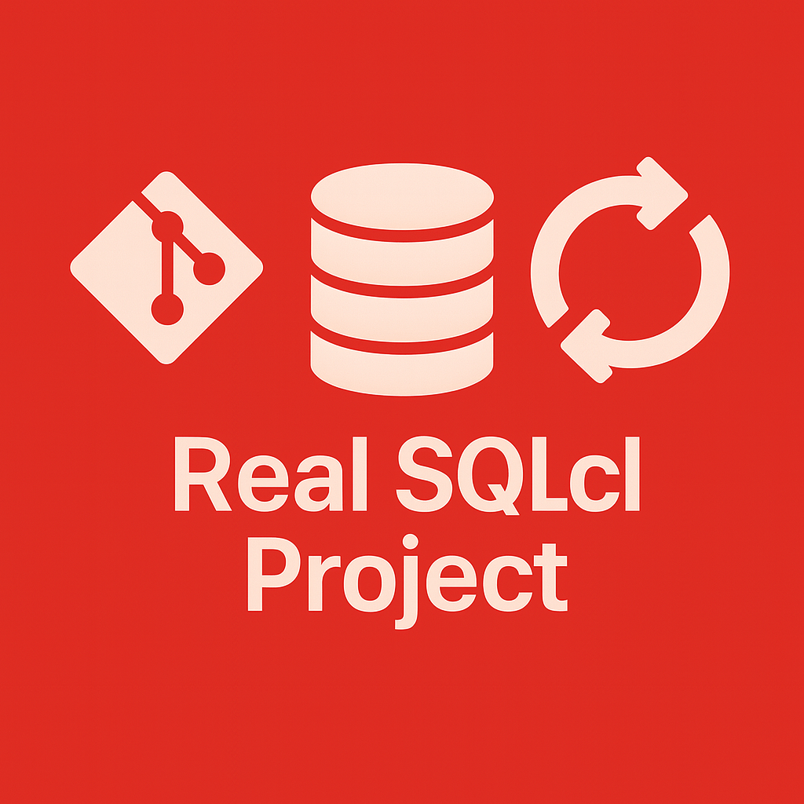

<picture>
  <source media="(prefers-color-scheme: dark)" srcset="real-sqlcl-project-logo-dark.png" />
  
</picture>

# SQLcl Project – Real-World Deployment Patterns & Best Practices

This repository contains **practical guidance**, **field-tested patterns**, and **ready-to-use workflows** for implementing reliable database and APEX deployments using **Oracle SQLcl Project**.

The goal is to provide what Oracle’s documentation does not:  
**How SQLcl Project behaves in real, messy, multi-schema, multi-environment systems — and how to use it safely on production projects.**

If you are working on medium-to-large Oracle APEX or PL/SQL systems, this repository gives you the missing manual for Git-driven, automated deployments.

---

## 🚀 What This Repository Covers

### ✔ End-to-end deployment workflows  
Development → Deployment Test → TEST → PROD  
With and without CI/CD.

### ✔ SQLcl Project best practices  
How to structure schemas, exports, filters, branches, and deploy artifacts.

### ✔ Drift detection & baseline synchronization  
How to detect what changed, why, and how to realign environments safely.

### ✔ Handling complex APEX deployments  
Restoring APEX metadata, preserving app states, dealing with REST, ACLs, credentials, and background jobs.

### ✔ Hotfix / emergency patch workflow  
How to safely patch production without corrupting mainline development.

### ✔ Security recommendations  
Permissions, roles, deployment accounts, secrets, network ACLs, and schema isolation.

### ✔ Real SQLcl Project bugs & enhancements  
A curated set of reproducible findings from real enterprise environments.

### ✔ Common commands & scripts  
Frequently used SQLcl, Liquibase, Git, and APEX commands for deployment pipelines.

---

## 📚 Full Documentation

The full set of guides is located in `/docs`.

See the index here:

👉 **[Documentation Index](docs/INDEX.md)**

---

## 📦 Recommended Audience

- Oracle APEX developers  
- PL/SQL developers  
- DevOps/DBA teams  
- Architects designing multi-environment pipelines  
- Anyone implementing CI/CD for Oracle APEX or PL/SQL  
- Consultants working with legacy or inconsistent environments  

If you deploy Oracle systems at real scale, you will find practical guidance here that existing docs simply do not provide.

---

## 🎯 Project Goals

- Provide **clear, reusable** SQLcl Project patterns  
- Reduce deployment failures and environment drift  
- Standardize developer → test → production workflows  
- Capture real-world SQLcl behavior and gotchas  
- Encourage safe Git-based deployment practices  

---

## 🏷 GitHub Topics

oracle oracle-apex sqlcl sqlcl-project database-deployment cicd database-versioning
oracle-devops liquibase plsql oracle-database oracle-sql apex-deployment drift-detection
database-automation devops gitops continuous-delivery oracle-cloud apex

---

## 🤝 Contributions

This repository reflects real production experience, but contributions, corrections, and additional examples are encouraged.

If you have encountered a SQLcl Project edge case or pattern that others may benefit from — feel free to open an issue or submit a PR.

---

## 📜 License

MIT License — see `LICENSE` file.

