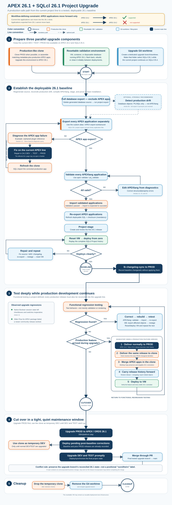
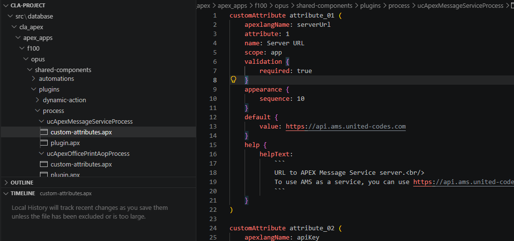
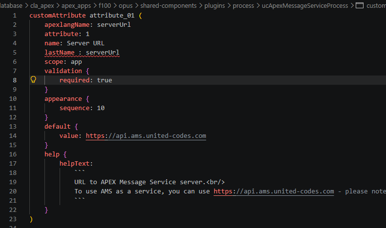
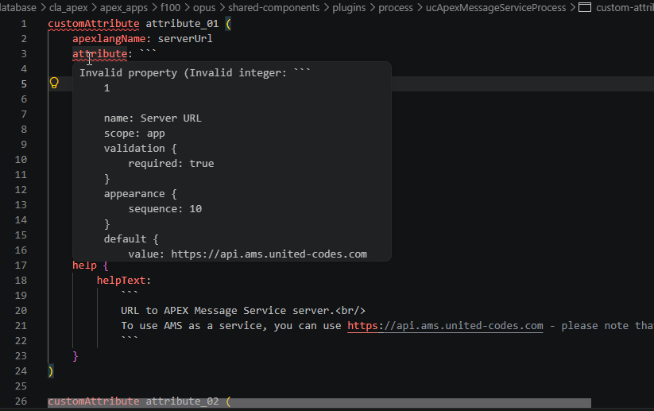
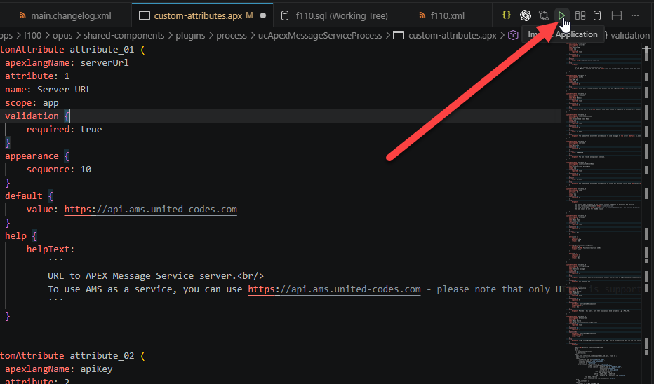
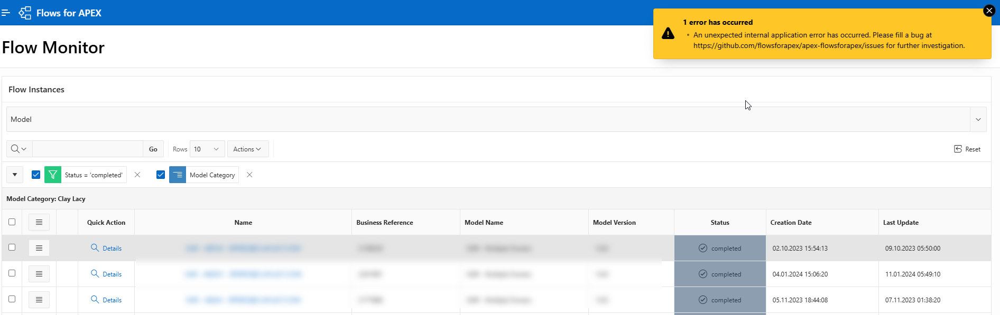
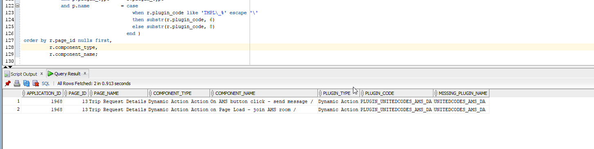
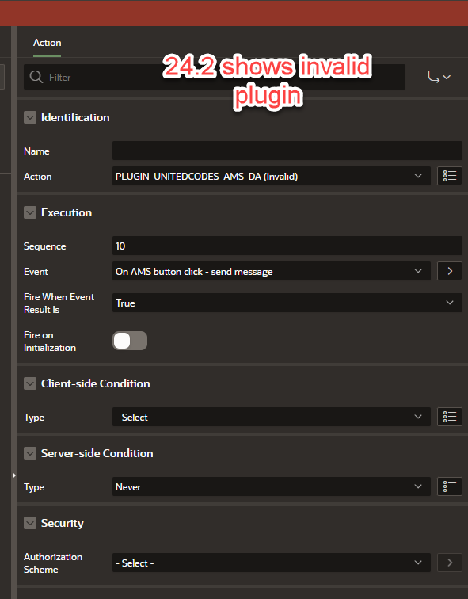
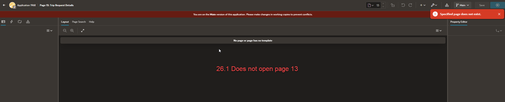

# APEX 26.1 & SQLcl 26.1 Upgrade Guide

## Table of Contents

- [APEX 26.1 \& SQLcl 26.1 Upgrade Guide](#apex-261--sqlcl-261-upgrade-guide)
  - [Table of Contents](#table-of-contents)
  - [TL;DR](#tldr)
  - [1. Before You Begin](#1-before-you-begin)
    - [1.1. Scope and Audience](#11-scope-and-audience)
    - [1.2. Assumed Starting Point](#12-assumed-starting-point)
    - [1.3. Workflow-Defining Constraint: APEX Applications Move Forward Only](#13-workflow-defining-constraint-apex-applications-move-forward-only)
    - [1.4. Three Additional Upgrade Components](#14-three-additional-upgrade-components)
    - [1.5. Complete Upgrade Flow](#15-complete-upgrade-flow)
  - [2. End-to-End Upgrade Workflow](#2-end-to-end-upgrade-workflow)
    - [2.1. Phase 1: Prepare the Upgrade Components](#21-phase-1-prepare-the-upgrade-components)
      - [2.1.1. Choose a relatively quiet period](#211-choose-a-relatively-quiet-period)
      - [2.1.2. Build the production-like clone](#212-build-the-production-like-clone)
      - [2.1.3. Prepare the resettable validation environment](#213-prepare-the-resettable-validation-environment)
      - [2.1.4. Create the SQLcl 26.1 worktree](#214-create-the-sqlcl-261-worktree)
    - [2.2. Phase 2: Establish the Deployable 26.1 Baseline](#22-phase-2-establish-the-deployable-261-baseline)
      - [2.2.1. Understand the standard SQLcl upgrade starting point](#221-understand-the-standard-sqlcl-upgrade-starting-point)
      - [2.2.2. Delete generated source](#222-delete-generated-source)
      - [2.2.3. Export database objects, excluding APEX applications](#223-export-database-objects-excluding-apex-applications)
      - [2.2.4. Optionally detect and resolve production drift](#224-optionally-detect-and-resolve-production-drift)
      - [2.2.5. Export every APEX application separately](#225-export-every-apex-application-separately)
      - [2.2.6. Validate every APEXlang application](#226-validate-every-apexlang-application)
      - [2.2.7. Import the validated applications](#227-import-the-validated-applications)
      - [2.2.8. Re-export the corrected APEX applications](#228-re-export-the-corrected-apex-applications)
      - [2.2.9. Run `project stage` and review the baseline release](#229-run-project-stage-and-review-the-baseline-release)
      - [2.2.10. Prove a clean deployment](#2210-prove-a-clean-deployment)
      - [2.2.11. Declare and synchronize the baseline](#2211-declare-and-synchronize-the-baseline)
    - [2.3. Phase 3: Test and Incorporate Production Changes](#23-phase-3-test-and-incorporate-production-changes)
      - [2.3.1. Perform functional regression testing in the clone](#231-perform-functional-regression-testing-in-the-clone)
      - [2.3.2. Correct, rebuild, and retest](#232-correct-rebuild-and-retest)
      - [2.3.3. Incorporate every release that reaches production](#233-incorporate-every-release-that-reaches-production)
        - [2.3.3.1. Database object and PL/SQL changes](#2331-database-object-and-plsql-changes)
        - [2.3.3.2. Incorporate APEX application changes](#2332-incorporate-apex-application-changes)
      - [2.3.4. Testing completion gate](#234-testing-completion-gate)
      - [2.3.5. Cut the production release](#235-cut-the-production-release)
    - [2.4. Phase 4: Cut Over](#24-phase-4-cut-over)
      - [2.4.1. Upgrade PROD first](#241-upgrade-prod-first)
      - [2.4.2. Use the clone as temporary DEV](#242-use-the-clone-as-temporary-dev)
      - [2.4.3. Upgrade DEV and TEST promptly](#243-upgrade-dev-and-test-promptly)
      - [2.4.4. Merge the upgrade branch through a pull request](#244-merge-the-upgrade-branch-through-a-pull-request)
    - [2.5. Phase 5: Cleanup](#25-phase-5-cleanup)
  - [3. Problems That Can Cost Hours](#3-problems-that-can-cost-hours)
    - [3.1. Why a Separate Upgrade Environment Is Required](#31-why-a-separate-upgrade-environment-is-required)
    - [3.2. Orphaned Plug-in References Block APEX Application Export](#32-orphaned-plug-in-references-block-apex-application-export)
    - [3.3. Binary File Corruption During APEXlang Export](#33-binary-file-corruption-during-apexlang-export)
    - [3.4. Supporting Objects Block `project stage`](#34-supporting-objects-block-project-stage)
    - [3.5. ORDS Export and Staging Problems](#35-ords-export-and-staging-problems)
      - [ORDS export silently fails with the deployer account](#ords-export-silently-fails-with-the-deployer-account)
      - [`project stage` regenerates ORDS changes](#project-stage-regenerates-ords-changes)
    - [3.6. Grant Filename Changes Produce Staging Artifacts](#36-grant-filename-changes-produce-staging-artifacts)
  - [4. Reference Material](#4-reference-material)
    - [4.1. Known Issues and Workarounds](#41-known-issues-and-workarounds)
    - [4.2. Related Repository Articles](#42-related-repository-articles)
    - [4.3. External References](#43-external-references)

---

## TL;DR

- This guide is for teams already managing a real Oracle APEX application as a SQLcl Project across DEV, TEST, PROD, or additional environments, and preparing to move that project to APEX 26.1 and SQLcl 26.1. It is not a guide to installing APEX itself; the technical platform upgrade is treated as one infrastructure step within the larger project-upgrade process.

- Do not simply upgrade DEV and assume the project will continue through TEST and PROD without problems. APEX applications can move from an older APEX release to a newer one, but applications exported from 26.1 cannot be deployed back to an older environment. A real upgrade can also expose SQLcl Project export defects, invalid APEX components, APEXlang validation errors, production drift, and functional regressions that remained hidden on APEX 24.2.

- Based on an actual production upgrade, this guide provides a repeatable workflow using a production-like clone, a resettable validation environment, and a dedicated Git worktree. It shows how to establish and stage a deployable 26.1 baseline, prove it through a clean installation, perform regression testing, incorporate releases delivered to production during the upgrade, and complete a production-first cutover. The documented problems, workarounds, screenshots, and test cases come from the upgrade itself.

---

## 1. Before You Begin

### 1.1. Scope and Audience

This guide describes what an application team must do to upgrade a live SQLcl Project-managed application to APEX 26.1 and SQLcl 26.1.

The guide identifies when an environment must be upgraded to APEX and ORDS 26.1, but it does not explain how the DBA or platform team performs that installation. Treat each instruction to “upgrade APEX/ORDS in this environment” as an infrastructure step within the project workflow.

The intended audience already has:

- an application and its database objects maintained as a SQLcl Project in Git;
- multiple environments, normally DEV, TEST, and PROD;
- an established deployment process through those environments; and
- a stable branch, normally `main`, that is expected to represent production.

Developers may work directly with DEV and TEST while another team controls production deployment. Nothing in this workflow requires direct developer access to PROD, but it does require coordination with whoever upgrades and deploys to production.

> **Aliases used throughout this guide:** The examples use repository aliases such as `prj_exp_app`, `prj_validate`, `prj_compile`, `prj_status`, `prj_install`, and `prj_sync`. They are productivity shortcuts and, in several cases, workarounds for known SQLcl behavior. Load them from [`scripts/xml/sqlcl-project-aliases.xml`](../scripts/xml/sqlcl-project-aliases.xml) and see [Article 12: Common Commands, Directives, and Aliases](12.-Common-Commands-and-Directives.md) for their definitions and equivalent commands.

### 1.2. Assumed Starting Point

The concrete example in this guide starts with:

- APEX 24.2 on the current application line;
- SQLcl 25.4 for ordinary project work;
- APEX 26.1 and SQLcl 26.1 as the target combination; and
- normal business development continuing while the upgrade branch is open.

The same process applies when the current APEX or SQLcl versions are earlier, but commands and observed defects must be checked against the exact releases in use.

### 1.3. Workflow-Defining Constraint: APEX Applications Move Forward Only

> **Critical:** An application exported from an older APEX release can be imported into a newer APEX release. An application exported from APEX 26.1 cannot be imported back into APEX 24.2.

There is no backward-compatibility mode that turns a 26.1 application export into a 24.2 deployment artifact. This rule defines the entire workflow:

- the current DEV/TEST/PROD line must remain available while the upgrade is prepared;
- ordinary features must reach production through the current APEX line first;
- those production changes can then be carried forward into the 26.1 clone; and
- development must not restart exclusively on 26.1 while PROD still requires 24.2-compatible application exports.

This is why “upgrade DEV first and see what happens” is unsafe for a live project. See [Section 3.1](#31-why-a-separate-upgrade-environment-is-required).

### 1.4. Three Additional Upgrade Components

In addition to the current DEV/TEST/PROD line, prepare three components:

1. **A production-like clone.** This is where the current production application estate is upgraded to APEX 26.1, corrected, and functionally tested.
2. **A resettable validation environment.** This is where the complete SQLcl Project is repeatedly deployed from a known clean state.
3. **A dedicated Git worktree.** This isolates the SQLcl 26.1 representation and upgrade releases while normal development continues with the current SQLcl version.

The environments have different jobs. The clone proves that the real applications work after the platform upgrade; the resettable environment proves that the project can recreate the result from source and deployment history.

### 1.5. Complete Upgrade Flow



*Figure 16-1. The complete upgrade flow. Solid lines are mandatory paths; dotted lines are optional paths. Colors identify the environment or working area used for each action.*

The remainder of Section 2 follows this diagram from top to bottom.

---

## 2. End-to-End Upgrade Workflow

### 2.1. Phase 1: Prepare the Upgrade Components

#### 2.1.1. Choose a relatively quiet period

The baseline work and functional testing may take days or weeks. Every feature that reaches production during that period must also be reconciled into the upgrade branch.

The ideal start is the end of a sprint or another point with little in-flight work. If development cannot pause, record all active releases and follow the incorporation loop in [Section 2.3.3](#233-incorporate-every-release-that-reaches-production).

#### 2.1.2. Build the production-like clone

A direct production clone is the highest-fidelity option, but it is not the minimum requirement. The clone may be assembled by other means as long as its database and APEX metadata are as close to production as practical.

Possible approaches include:

- a database clone supplied by the DBA;
- Data Pump export/import of production database metadata; or
- a separately provisioned database populated with the required schemas and metadata.

Data Pump does **not** export APEX applications. When the clone is assembled with `expdp`/`impdp`, export the selected production APEX applications separately and install them into the clone. Production data is not required for this workflow and may be removed or sanitized; metadata fidelity is what matters.

Have the DBA or platform team upgrade APEX and ORDS in the clone to 26.1. The technical installation is outside the scope of this guide.

#### 2.1.3. Prepare the resettable validation environment

The validation environment may be a VM, container, disposable cloud database, or another reliably rebuildable environment. It may already run APEX 26.1; unlike the production-like clone, it does not need to demonstrate an in-place upgrade from the old APEX release.

For the upgrade documented here, I used Oracle’s [Oracle AI Database 26ai Free VirtualBox Appliance](https://www.oracle.com/database/technologies/databaseappdev-vm.html). The appliance provided a convenient local database environment that could be configured with Flashback Database and repeatedly returned to a known state. The appliance used during this project originally contained an earlier APEX release, so preparing it for this workflow included a separate upgrade to APEX 26.1.

Oracle has since retired the VirtualBox appliance. Its former download page now directs new users to the [Oracle AI Database FREE Container](https://container-registry.oracle.com/ords/ocr/ba/database/free) instead. For a new validation environment, use the container or another currently available Oracle database image, then install and configure the required APEX/ORDS 26.1 stack if it is not already included. The container changes the reset mechanism—not the purpose of the environment: it must remain disposable or reliably cleanable and capable of proving the complete project installation.

The essential requirement is repeatability:

- flash back the database;
- rebuild or replace the environment; or
- run a reliable cleanup procedure that returns it to a known starting state.

A VM with Flashback Database is convenient. An Autonomous Database or another cloud database can also work, but recreating or cleaning it may take longer.

> **Installer design note:** The most efficient project installer uses a privileged deployment account that can create application schemas, grant privileges, and create the APEX workspace. That allows a reset to be followed by a true “nothing to everything” installation. Teams that deploy only as schema owners can still use this process, but must provision users, workspaces, and infrastructure privileges before each project installation. See [Article 01](01.-Installation-and-Configuration.md).

#### 2.1.4. Create the SQLcl 26.1 worktree

> **Where this step is performed:** Create the worktree on the workstation of the developer or developers responsible for the upgrade. These should be team members who already use the SQLcl Project in their daily development and deployment work. The worktree is a developer working environment; it is not created on the database server.

Create a dedicated branch and worktree from the stable production branch:

```bash
git worktree add -b apex-26.1-upgrade ../my-project-26.1 main
cd ../my-project-26.1
```

The upgrade folder must select SQLcl 26.1 while the ordinary project folder continues to select the current SQLcl version. This repository demonstrates folder-aware SQLcl selection in [`scripts/bash/tools/.bashrc`](../scripts/bash/tools/.bashrc).

The worktree is more than branch isolation. It allows the same developer, on the same machine, to keep the ordinary project folder open for feature delivery and production fixes while the upgrade folder remains open for long-running 26.1 work. Both folders belong to the same Git repository, so the upgrade branch can be compared with `main` without repeatedly checking out branches in one working directory.

Without a worktree, every context switch requires checking out the other branch and remembering to select the matching SQLcl executable. That is error-prone during an upgrade that overlaps normal development. A dedicated folder plus directory-aware SQLcl selection makes each context explicit and is strongly recommended for this workflow. See [SQLcl Version Switching by Directory](https://alexonapex.com/blog/2026/08/22/sqlcl-version-switching-by-directory/).

Update the worktree’s `sqlcl.version` property in `.dbtools/project.config.json` to the target SQLcl version. Keep that configuration change on the upgrade branch until cutover.

Verify both locations before continuing:

```bash
cd ../my-project-26.1
sql -v

cd ../my-project
sql -v
```

The exact paths and version-switching mechanism are local choices; the invariant is that commands in the upgrade worktree use SQLcl 26.1.

### 2.2. Phase 2: Establish the Deployable 26.1 Baseline

The first major objective is not merely a refreshed `src` directory. It is a reviewed SQLcl 26.1 release that can deploy the corrected APEX 26.1 project from a clean environment.

#### 2.2.1. Understand the standard SQLcl upgrade starting point

Oracle’s [SQLcl Projects upgrade guidance](https://docs.oracle.com/en/database/oracle/sql-developer-command-line/26.2/sqcug/upgrading-sqlcl-when-using-sqlcl-projects.html#GUID-DC48C700-4271-4BDB-87E0-DEEB70D93337) recommends:

1. creating a dedicated upgrade branch;
2. updating the SQLcl version in project configuration;
3. deleting `src/database`; and
4. re-exporting with the new SQLcl version; and
5. committing the regenerated source and merging the upgrade branch into `main`.

[Dan McGhan’s companion article](https://danmcghan.hashnode.dev/upgrading-sqlcl-when-using-sqlcl-projects) explains the same tool-version upgrade pattern and the value of starting during a quiet development period.

> **Why the standard workflow does not run `project stage`:** The standard SQLcl Project upgrade assumes that only the SQLcl version changes. All logical database and application changes have already been deployed and are present in PROD. Re-exporting merely updates the generated source to the new SQLcl representation—for example, changed formatting or additional generated attributes—so that future comparisons and staging start from the new format. Because there is no new deployable change, the standard workflow has nothing to stage, release, synchronize, or deploy before the regenerated source is committed and merged.

This combined APEX and SQLcl upgrade must go further. In addition to changing the SQLcl Project version, it upgrades a major APEX version and adopts APEXlang. The existing application SQL files and checksums under `dist/releases/apex` do not describe the newly exported 26.1 application state. Re-exporting regenerates source, but it does not create the updated APEX deployment entries or prove that the complete project remains deployable.

For a uniform, reviewable baseline, this workflow always:

1. exports every APEX application on 26.1;
2. stages every application so `dist/releases/apex` contains the 26.1 export and checksum;
3. proves the complete project on the resettable environment; and
4. synchronizes the baseline changelog in PROD so these baseline applications are recorded without being reinstalled there.

This treatment is easiest to understand by separating the five kinds of changes found during the upgrade:

| Change category | Where it is discovered | Required treatment |
|---|---|---|
| Export-blocking application defects | An APEX application cannot be exported on 26.1—for example, an orphaned plug-in reference | Fix on the current APEX line, promote through DEV/TEST/PROD, refresh the clone, and retry. The fix is already in PROD before the baseline is staged. |
| Meaningful production drift | The SQLcl 26.1 database export reveals a real PROD difference missing from Git | Decide whether to retain or remove it through the normal lineage. Retained drift is staged for new and downstream environments, then synchronized in PROD because PROD already contains it. |
| APEXlang validation/import corrections | Exported applications require source corrections before they validate or import cleanly on 26.1 | Correct and re-export the clone applications. All applications are staged with their 26.1 checksums and synchronized in PROD as part of the baseline. |
| Supporting Objects staging corrections | `project stage` fails when SQLcl 26.1 encounters Supporting Object files in an APEX application | Update the affected clone application by removing its Supporting Objects, then re-export the corrected application and run `project stage` again. Treat the resulting application export like an APEXlang validation/import correction: include it in the synchronized baseline. |
| Functional regression corrections | Runtime testing finds behavior that will fail after the production APEX upgrade—for example, native Boolean controls | Stage after the baseline. Do **not** synchronize these changes in PROD; they must remain pending and deploy immediately after PROD is upgraded. |

The first four categories contribute to the synchronized baseline. The fifth category is deliberately created after baseline synchronization and becomes the actual pending production upgrade payload. This is why the process cannot stop after `project export`.

#### 2.2.2. Delete generated source

Start with a clean generated database source tree. As recommended in the SQLcl upgrade guide, navigate to the SQLcl 26.1 upgrade worktree and delete the generated database source directory:

```bash
cd ../my-project-26.1
rm -rf src/database
```

Use the equivalent safe command for your operating system and verify that the target is the worktree’s generated `src/database` directory.

#### 2.2.3. Export database objects, excluding APEX applications

Connect SQLcl 26.1 to the upgraded production-like clone and run the project’s full database export with APEX applications excluded by the project filters or export selection.

```sql
conn -name proj_d261
project export -t 4
```

Exclude APEX applications from this full database export in the default filter file, `.dbtools/filters/project.filters`:

```sql
export_type not in ('APEX_APPLICATIONS'),
```

The purpose of this export is to regenerate database-object source—tables, packages, views, grants, synonyms, and other configured objects—in the SQLcl 26.1 representation.

Do not use this full database export as the final APEX application export. In the SQLcl 26.1 version used here, a reproducible defect corrupts binary APEX application files. Applications are exported separately in [Section 2.2.5](#225-export-every-apex-application-separately).

Keep the `APEX_APPLICATIONS` exclusion active through any optional drift-detection cycle in [Section 2.2.4](#224-optionally-detect-and-resolve-production-drift), because that cycle repeats this full database export. After the final database export is complete, comment out or remove the following line from `.dbtools/filters/project.filters` before proceeding to the separate application exports:

```sql
-- export_type not in ('APEX_APPLICATIONS'),
```

#### 2.2.4. Optionally detect and resolve production drift

Production drift detection is not required merely to change tool versions, but this production-like export is an unusually good opportunity to verify that `main` still represents PROD.

The SQLcl 26.1 diff will contain:

- serialization and formatting changes introduced by the SQLcl version;
- additional generated metadata that does not change behavior; and
- potentially real production changes that are missing from Git.

The complete drift-detection method—including how to distinguish serialization noise from meaningful production differences and how to resolve the differences that remain—is discussed in [Article 06: Mitigating Production Drift](06.-Mitigating-Production-Drift.md).

This repository also contains the cleanup script developed and maintained for the environment used in this guide. Run it from the upgrade worktree and review what remains:

```bash
scripts/bash/tools/drift_cleanup.sh
```

The script is a project-specific implementation, not a universal SQLcl cleanup utility. Use it as an example: inspect its rules, retain only those that match the generated differences in your environment, and add or develop cleanup rules for your own project as required.

Resolve real drift through the current application lineage:

- formalize a legitimate production change through DEV and TEST; or
- create a controlled patch to remove an unwanted production change.

Do not automatically accept every difference from the clone as desired source. Treat drift detection as a temporary filtering exercise:

1. compare the exported database source with `main`;
2. restore differences that are only SQLcl formatting, serialization, or other non-semantic changes back to the `main` representation;
3. repeat the cleanup and review until the remaining working-tree differences represent meaningful production drift; and
4. resolve each meaningful difference through the appropriate current-line correction or upgrade-baseline decision.

This continuous reversion makes the real drift visible, but it also leaves the upgrade worktree intentionally incomplete: files containing only SQLcl 26.1 representation changes have been restored to their older `main` form.

After drift detection and its required resolutions are complete, repeat the full database export from [Section 2.2.3](#223-export-database-objects-excluding-apex-applications) in the SQLcl 26.1 upgrade worktree. This final export restores the complete SQLcl 26.1 source representation—including the formatting and generated-metadata differences temporarily reverted during analysis—before APEX applications are exported and `project stage` is run later in the workflow.

The export is repeated in the upgrade worktree; it is not written directly to `main`. The completed and tested upgrade branch reaches `main` only through the final merge.

#### 2.2.5. Export every APEX application separately

In the SQLcl 26.1 version used for this upgrade, exporting an APEX application through ordinary `project export` reproducibly corrupts its binary files. The full database export therefore excludes APEX applications, and every application is exported explicitly through the repository’s `prj_exp_app` workaround.

The alias performs two exports for one application:

1. `project export -o APEX.<app_id>` generates the deployable `fNNN.sql` application file and SQLcl Project checksum.
2. `apex export -applicationid <app_id> -exptype APEXLANG ... -f` replaces the corrupted APEXlang/binary export. The `-f` option refreshes the export directory so stale pages and shared components do not remain.

The alias definition makes the SQLcl 26.1-specific branch explicit. For the affected `2601020000` SQLcl build, it follows the project export with a direct APEXlang export using `-f`. For other builds, the second branch validates the project-generated APEXlang source instead:

```sql
SQL> conn -n proj_dev
Connected.
SQL> alias details prj_exp_app
prj_exp_app
-----------
  app_id: app_id
-----------
set define on
column app_id new_value app_id
select :app_id app_id from dual;
prompt Exporting APEX Application ID &app_id...
project export -o APEX.&APP_ID.
column cmd new_value cmd noprint
column msg new_value msg noprint
set verify off
select
 case when '&_SQLPLUS_RELEASE' = '2601020000'
  then 'export -applicationid &APP_ID. -exptype APEXLANG -dir src/database/' ||
       lower(owner) || '/apex_apps/f' || application_id || ' -f'
  else 'validate -input src/database/' || lower(owner) ||
       '/apex_apps/f' || application_id || '/' || lower(alias) ||
       ' -ws ' || workspace
 end as cmd,
 case when '&_SQLPLUS_RELEASE' = '2601020000'
  then 'Bug in 26.1 -Rexported application ' || application_id ||
       ' to src/database/' || lower(owner) || '/apex_apps/f' || application_id
  else 'Validating APEXlang app &APP_ID. ...'
 end as msg
from apex_applications
where application_id = :app_id;
prompt &msg.
apex &cmd.
set define off
```

The following execution shows both operations. The SQLcl Project export creates the application deployment artifact first; the 26.1 branch then replaces the APEXlang application directory:

```text
SQL> prj_exp_app 100

Exporting APEX Application ID 100..
*** APEX_APPLICATIONS ***
Exporting Workspace CLA_INTERNAL - application 100:OPUS
-------------------------------
APEX_APPLICATION              1
-------------------------------
Exported 1 objects
Elapsed 49 sec

Bug in 26.1 -Rexported application 100 to src/database/cla_apex/apex_apps/f100
Exporting Workspace CLA_INTERNAL - application 100:OPUS
File src\database\cla_apex\apex_apps\f100\opus\application.apx created
```

`proj_dev`, application `100`, and the workspace shown above are project-specific examples; use the clone connection and application identifiers for the project being upgraded.

Create a SQL file that connects to the clone and lists every production application:

```sql
conn -name proj_d261
prj_exp_app 110
-- additional applications omitted
prj_exp_app 210
prj_exp_app 310
```

See the alias implementation in [`scripts/xml/sqlcl-project-aliases.xml`](../scripts/xml/sqlcl-project-aliases.xml), its command reference in [Article 12](12.-Common-Commands-and-Directives.md#23-prj_exp_app), and the original workflow discussion in [Article 14](14.-SQLcl-Project-with-APEXlang-First-Impressions.md#145-exporting-an-existing-sqlcl-project-to-apexlang).

> **Important — an application can still fail after the binary-file workaround:** Most APEX applications should export successfully through `prj_exp_app`. During this upgrade, however, one application exposed a second problem while the alias was running: the application itself was inconsistent and could not be exported. In the observed case, a deleted plug-in still had component references on an application page. This application-specific failure and its diagnostic query are described in [Section 3.2](#32-orphaned-plug-in-references-block-apex-application-export).

For each application affected by this problem:

1. return to the still-available APEX 24.2 DEV environment;
2. identify every affected component using the diagnostics described in [Section 3.2](#32-orphaned-plug-in-references-block-apex-application-export);
3. correct the inconsistent components on the APEX 24.2 DEV line;
4. promote that correction normally through TEST and PROD;
5. SQL-export the corrected production application;
6. import it into the APEX 26.1 clone; and
7. retry only that application’s export.

Do not rerun the database-object export for an application-only failure. Continue until every production application has been exported safely.

#### 2.2.6. Validate every APEXlang application

Run `apex validate` against each exported application, preferably through the alias:

```sql
prj_validate 110
```

The alias validates the exported APEXlang application locally and supplies its workspace explicitly. Its implementation shows the complete command it constructs:

```sql
SQL> alias details prj_validate
prj_validate
------------
  app_id: app_id
------------
set define on
column apex_src_path new_value apex_src_path noprint
column app_id new_value app_id noprint
select :app_id app_id,
       'src/database/' || lower(owner) ||
       '/apex_apps/f' || application_id ||
       '/' || lower(alias) ||
       ' -ws ' || workspace as apex_src_path
  from apex_applications
 where application_id = :app_id;
prompt Validating APEXlang app &APP_ID. from &APEX_SRC_PATH. ...
apex validate -input &APEX_SRC_PATH.
set define off
```

This is faster than repeatedly importing the application into the database merely to discover the next structural problem. Validation failures are expected and useful. Unlike the catastrophic orphaned-component export failure, normal validation behaves like a compiler: it identifies the invalid APEXlang file, structure, or property and reports diagnostics that can be corrected in the Git worktree.

> **About these examples:** The terminal output and editor states below were reconstructed after the upgrade because screenshots were not captured during the original correction work. They use the same application source and commands and reproduce the three kinds of validation result encountered during that work.

**Case 1: validation succeeds with warnings.** A successful validation can still report actionable warnings. Here the application compiled, but SQLcl reported a deprecated property and a page alias/filename mismatch:

```text
SQL> prj_validate 100

Validating APEXlang app 100 from src/database/cla_apex/apex_apps/f100/opus -ws CLA_INTERNAL ...
APEXLang Compile Warnings:
File: application.apx
Line: 73
Column: 8
Type: PROPERTY_DEPRECATED
Warning: Property appBuilderIconName is deprecated.

File: pages/p10041-page-help.apx
Line: 3
Column: 4
Type: FILENAME_MISMATCH
Warning: Page alias in the file does not match that in the filename

Validation successful.
```

Warnings do not make the validation fail, but they should still be reviewed rather than hidden by a generic success message. The Oracle SQL Developer extension for Visual Studio Code provides APEXlang syntax coloring, structural highlighting, and editor diagnostics while the files are being corrected.



*Figure 16-2. A valid APEXlang custom-attribute definition in Visual Studio Code.*

**Case 2: validation returns a source-level error.** Adding the nonexistent `lastName` token produces a precise filename, line, column, error type, and offending text:

```text
SQL> prj_validate 100

Validating APEXlang app 100 from src/database/cla_apex/apex_apps/f100/opus -ws CLA_INTERNAL ...
APEXLang Compile Errors:
File: shared-components/plugins/process/ucApexMessageServiceProcess/custom-attributes.apx
Line: 5
Column: 4
Type: SYNTAX
Error: token recognition error at: 'lastName : s'

File: shared-components/plugins/process/ucApexMessageServiceProcess/custom-attributes.apx
Line: 5
Column: 16
Type: SYNTAX
Error: token recognition error at: 'erverUrl\n'
```

The editor identifies the same syntax problem immediately, before the next command-line validation is run.



*Figure 16-3. The invented `lastName` property is underlined as invalid in the editor.*

**Case 3: validation terminates with a Java exception.** Not every invalid structure is returned as a polished compiler diagnostic. Supplying a multi-line block where the plug-in attribute number is expected caused a `NumberFormatException`:

```text
SQL> prj_validate 100

Validating APEXlang app 100 from src/database/cla_apex/apex_apps/f100/opus -ws CLA_INTERNAL ...
2026-08-26 17:00:33.643 SEVERE oracle.dbtools.raptor.newscriptrunner.ScriptExecutor run java.base/java.lang.NumberFormatException.forInputString(Unknown Source)
java.lang.NumberFormatException: For input string: "null"
        at java.base/java.lang.NumberFormatException.forInputString(Unknown Source)
        at java.base/java.lang.Integer.parseInt(Unknown Source)
        at java.base/java.lang.Integer.parseInt(Unknown Source)
        at oracle.apexlang.core.ComponentPlugin.getAttributeValueFromComponent(ComponentPlugin.java:658)
        at oracle.apexlang.core.ComponentPlugin.createCustomAttributeFrom
        ...
```

Although this is a tool exception rather than a normal compile error, it still narrows the problem to a value that should be an integer. In the editor, the invalid property is underlined and its hover message explicitly reports **Invalid integer**.



*Figure 16-4. The editor tooltip explains the malformed integer property that caused the Java exception.*

For each application:

1. run `prj_validate <app_id>`;
2. edit the affected `.apx` files;
3. validate again; and
4. repeat until validation succeeds.

The SQL Developer extension also provides a green compile/import button whose **Import Application** action validates and imports APEXlang into the database. It can be useful after the local validation loop is clean.



*Figure 16-5. SQL Developer for VS Code exposes an Import Application action in the editor toolbar.*

For iterative correction, the CLI alias remains preferable:

- validation is faster because it does not import after every edit;
- the complete warnings and errors remain visible in the terminal; and
- `prj_validate` queries `apex_applications` and passes the correct `-ws` workspace value.

That last point matters when the connected deployment user can access multiple APEX workspaces. In this project, the editor action could not determine which workspace to use and failed, whereas the alias selected the application’s workspace explicitly. Teams whose editor connection resolves to one workspace may be able to use the button successfully. Otherwise, validate with `prj_validate` and import with `prj_compile` as described next.

[Article 14](14.-SQLcl-Project-with-APEXlang-First-Impressions.md#146-validating-and-importing-apexlang) introduces the export/validate/import cycle. This guide applies it to a complete production upgrade.

#### 2.2.7. Import the validated applications

After validation passes, import the APEXlang application into the 26.1 clone:

```sql
prj_compile 110
```

The alias wraps `apex import`. Import also validates, but using it for every edit is slower than running the local validation loop first.

In this upgrade, every application that passed `apex validate` imported successfully. If import fails after clean validation, record the exact error as a separate problem rather than treating repeated import attempts as the expected workflow.

> **Niche — agent/MCP workflows only:** When an agent invokes SQLcl through MCP, `apex import` may encounter the autocommit problem described in [Article 14](14.-SQLcl-Project-with-APEXlang-First-Impressions.md#146-validating-and-importing-apexlang). This is relevant only to teams that depend heavily on agent-driven SQLcl execution. Run the import directly from SQLcl when necessary.

#### 2.2.8. Re-export the corrected APEX applications

This second export is mandatory:

```sql
prj_exp_app 110
```

Editing and importing APEXlang changes the live application in the clone. It does not automatically refresh every generated project artifact.

`project stage` deploys the generated `fNNN.sql` application export and its checksum; it does not deploy the `.apx` files directly. Skipping this re-export leaves a stale SQL application export and causes the eventual installation to deploy the pre-correction application.

#### 2.2.9. Run `project stage` and review the baseline release

With database source and APEX application exports aligned, create the first deployable 26.1 changesets:

```sql
project stage
```

This stage is intentionally uniform: every production application receives a SQLcl Project entry containing its APEX 26.1 export and checksum, even when no APEXlang correction was required. The baseline synchronization in [Section 2.2.11](#2211-declare-and-synchronize-the-baseline) prevents these baseline entries from reinstalling applications in PROD, while DEV and other refreshed environments receive the same 26.1 checksums.

Do **not** run `project release` yet. Keep the upgrade changes staged while functional testing and production-release reconciliation continue. The final release is cut only after the testing gate in [Section 2.3.5](#235-cut-the-production-release).

Review both `src` and `dist`:

> **Important — `next/changes` should normally be empty:** In most upgrades, `dist/releases/next/changes/<upgrade-branch-name>/` should contain no changesets. Retain files in this directory only when meaningful production drift was deliberately accepted and must be propagated to other or newly created environments. Discard every other changeset that `project stage` generated there from SQLcl formatting, serialization, or other non-semantic differences. The primary purpose of staging at this point is to create the refreshed APEX 26.1 application entries and checksums under `dist/releases/apex`; retained drift changesets are an optional side effect.

- With no real production drift, the baseline release should primarily contain the updated APEX application exports.
- If legitimate drift was accepted, database-object changesets may also be required.
- If an unwanted object exists accidentally in PROD, do not stage a CREATE changeset that propagates it elsewhere. Remove it from the intended source baseline and use a controlled production correction to delete it from PROD.
- If an object belongs in all environments, retain the changeset needed to reproduce it.

Several defects become visible during staging:

- Supporting Object files can block `project stage`. See [Section 3.4](#34-supporting-objects-block-project-stage).
- ORDS metadata can be missing from export or regenerated as staging noise. See [Section 3.5](#35-ords-export-and-staging-problems).
- SQLcl grant filename changes can generate artificial revoke/grant changesets. See [Section 3.6](#36-grant-filename-changes-produce-staging-artifacts).

#### 2.2.10. Prove a clean deployment

Reset the validation environment to its known starting point and run the complete installer:

```sql
conn -name proj_vm
prj_install
```

Deploying the complete project into this resettable validation environment is stronger than applying only the new baseline release. It proves that SQLcl Project 26.1 can replay the historical changesets created by earlier SQLcl versions and then install the corrected APEX 26.1 applications.

> **Clarifying note about `prj_install`:** `prj_install` is a repository shortcut for running the complete generated project installer: it enters `dist`, executes `install.sql`, and returns to the project root. What the deployment creates and configures is defined by that installer. This shortcut is especially efficient for validation and other environments the project team can deploy directly; DBA-controlled environments normally receive the reviewed deployment artifact through their handoff process. See [Article 12: `prj_install`](12.-Common-Commands-and-Directives.md#25-prj_install).
>
> ```sql
> SQL> alias details prj_install
> prj_install
> -----------
> cd dist
> prompt Running Project Installer Script...
> set define off
> @install.sql
> cd ..
> ```

If deployment fails:

1. fix the project source, drift decision, release history, or APEX application;
2. re-export affected objects or applications;
3. restage as needed;
4. reset the validation environment; and
5. deploy again.

Continue until the complete installation succeeds from a clean state.

#### 2.2.11. Declare and synchronize the baseline

The successful clean installation is the **Baseline** milestone. Record it before functional regression testing begins.

Review the baseline source and staged changes, then commit and tag the exact state that was proven on the validation environment:

```bash
git add .
git commit -m "APEX 26.1 Baseline"
git tag -a apex_26_1_baseline -m "APEX 26.1 Baseline"
```

> **Why tag the baseline:** A Git tag name is unique within the repository and identifies the exact commit that existed before functional regression testing began. A descriptive tag such as `apex_26_1_baseline` makes that state easy to inspect, compare, or return to later if the testing branch must be reconstructed. Follow the repository’s tag-naming convention if it requires a different name.

Push the branch and tag through the team’s normal review process. Production synchronization must use this reviewed changelog.

Run the repository’s Liquibase synchronization alias against **PROD**:

```sql
SQL> conn -n proj_prod
Connected.
SQL> prj_sync
Running the Liquibase changelog-sync Command to mark all changesets as executed...
--Starting Liquibase at 2026-07-14T13:49:37.207395300 using Java 17.0.13 (version 4.33.0 #0 built at 2025-12-09 17:47+0000)

Operation completed successfully.
```

The `prj_sync` alias changes to `dist` and runs:

```sql
lb changelog-sync -changelog-file releases/main.changelog.xml
```

Synchronization tells PROD that the baseline changesets describe its current state and must not be applied. Corrections discovered after this point remain pending and can be deployed during cutover.

> **Production access is required at this point.** The application team may need the DBA or production deployment team to perform the synchronization. Coordinate the operation and preserve its output as deployment evidence.

There are two practical handoff models:

1. **Direct SQLcl handoff.** Give the reviewed deployment artifact to the DBA, have them unzip it, load the project aliases, connect to PROD from the project folder, and run `prj_sync`.
2. **Deployment-pipeline handoff.** If policy requires the normal project-deployment mechanism, prepare a synchronization-specific artifact by replacing the `lb update` action in `dist/install.sql` with the commented `lb changelog-sync` action before submitting it. Review the artifact carefully so it cannot run both commands.

The standard installer section looks like this:

```sql
-- Kick off Liquibase
prompt "Installing/updating schemas"
lb update -log -changelog-file releases/main.changelog.xml -search-path "."

-- Uncomment to sync changelog without running changes
--prompt "Synching Liquibase ChangeLog"
--lb changelog-sync -changelog-file releases/main.changelog.xml -debug
```

For the synchronization artifact, comment out or remove `lb update` and enable the `lb changelog-sync` lines. This artifact is for the baseline synchronization only; it is not the later production upgrade installer.

> **Do not move this synchronization to the end of testing.** Recording the baseline first is what separates already-present production state from genuine post-baseline upgrade corrections.

### 2.3. Phase 3: Test and Incorporate Production Changes

#### 2.3.1. Perform functional regression testing in the clone

Validation and clean deployment prove structure and repeatability; they do not prove application behavior. Run the project’s real functional test plan against the production-like APEX 26.1 clone.

The duration is project-specific. It may take a day, a week, or a month. Test the business functions most likely to expose platform, plug-in, session-state, JavaScript, and packaged-application compatibility problems.

Two regressions were found in this upgrade:

1. **Native Boolean controls stopped working correctly.** Checkboxes and switches backed by native Boolean columns required Boolean session state. These properties can be changed in APEX App Builder, but finding and updating every affected component manually can be daunting. APEXlang exposes those properties as searchable source, making the bulk correction fast and straightforward, especially with agent-assisted development that can locate and apply the repetitive changes for review and validation. See [Article 15: Native Boolean Columns in Oracle APEX 26.1 and APEXlang](APEXlang/15.-Native-Boolean-Columns-in-Oracle-APEX-26.1-and-APEXlang.md).

   

   *Figure 16-6. Native Boolean-backed controls required the Session State Data Type to be changed from `VARCHAR2` to `BOOLEAN`.*

2. **Flows for APEX 22.2 stopped working on APEX 26.1.** The same version still worked on APEX 24.2. The underlying discontinued dependency was not investigated; upgrading Flows for APEX Community Edition to 25.1 restored operation.

   

   *Figure 16-7. A Flows for APEX 22.2 failure observed only after moving the application to APEX 26.1.*

These are examples, not an exhaustive compatibility list. Their importance is procedural: only functional regression testing exposed them.

#### 2.3.2. Correct, rebuild, and retest

For every regression:

1. reproduce and understand the problem in the clone;
2. edit APEXlang or correct the application in the clone;
3. validate and import APEXlang changes;
4. re-export the APEX application to refresh `fNNN.sql` and its checksum;
5. export affected database objects when required;
6. restage the pending correction;
7. deploy the updated project to the validation environment; and
8. repeat the functional test in the clone.

APEX application corrections are expected during an APEX upgrade. If testing exposes a PL/SQL or database fix that also belongs on the current production line, deliver it normally through DEV/TEST/PROD and then reconcile it into the upgrade branch.

Treat packaged applications and plug-ins differently from 26.1-only application-source corrections:

- If a packaged component’s older release fails on 26.1, test its current release in the 26.1 clone first.
- If that release also works on APEX 24.2, upgrade the package through the current DEV/TEST/PROD line and then refresh the clone. This keeps every environment on the same supported package version before cutover.
- Keep a correction on the upgrade branch only when it is specifically required by the APEX 26.1 application and cannot be delivered safely to the current line.

That is how Flows for APEX was handled: version 22.2 failed in the 26.1 clone, version 25.1 worked there, and version 25.1 was then deployed to all environments while they still ran APEX 24.2. By contrast, the native Boolean metadata correction was a real APEX 26.1 regression fix and remained pending for the production cutover.

Repeated export/stage cycles may also expose the ORDS problem described in [Section 3.5](#35-ords-export-and-staging-problems). This project exports through a privileged deployment user rather than an ordinary REST-enabled schema owner. If no ORDS change is part of the upgrade, ORDS may be temporarily excluded in `.dbtools/filters/project.filters`:

```sql
export_type not in ('ORDS_SCHEMA'),
```

Use this filter only after confirming that no real ORDS metadata change must be captured.

#### 2.3.3. Incorporate every release that reaches production

Business development may continue during the upgrade. Every feature or hot fix that reaches PROD must also be carried into the upgrade line.

Database and APEX application changes require different reconciliation strategies. Database changes are usually straightforward because a production release already has stable Liquibase history. APEX application changes are the difficult part: the current-line feature and the 26.1 upgrade corrections may modify the same application, and there is no automatic merge that can be trusted without review.

Before incorporating a production release, identify every affected APEX application. If no APEX application changed, carrying the database release history forward is normally mechanical. If an application changed, plan for a deliberate Working Copy merge or a detailed APEXlang comparison with hands-on or agent-assisted review.

The mandatory sequence is:

1. **Deliver normally to PROD.** Complete the ordinary current-version release and merge it into `main`.
2. **Prepare and deliver the same release to the clone.** Before installation, preserve each affected APEX 26.1 application as a Working Copy. Then use the current worktree and current SQLcl version so the clone receives the exact changeset identities and application release recorded by PROD.
3. **Merge the affected APEX applications in the clone.** Preserve the 26.1-corrected application as an APEX Working Copy before the current-line release overwrites the main application. Then merge the upgrade corrections back into the newly delivered application. See [Merging APEX Working Copies with APEXlang](https://alexonapex.com/blog/2026/07/24/merging-apex-working-copies-with-apexlang/).
4. **Carry the release history forward.** Restore the exact release folder from `main`, insert its include into the upgrade branch’s changelog controller, and then refresh all related source objects with SQLcl 26.1.
5. **Deploy to the validation environment.** Confirm that the production feature and every earlier 26.1 correction coexist and deploy correctly.

##### 2.3.3.1. Database object and PL/SQL changes

Database objects and PL/SQL require two actions: preserve the exact Liquibase release history already used by PROD, and refresh the corresponding generated source with SQLcl 26.1.

**Preserve exact Liquibase history.**

PROD and the clone have already run the current-line release. Preserve its paths, changeset identifiers, and content when copying it into the upgrade branch. Do not generate a second staged release for the same database change.

The release folder is created by `project release`; it does not appear by convention or manual folder creation. For example, the current development line packages its next production deployment as release `26.3` by running:

```sql
project release -version 26.3
```

The command performs two related changes:

1. it creates `dist/releases/26.3/` and moves the release changes into that versioned history; and
2. it adds the following include to `dist/releases/main.changelog.xml`:

```xml
<include file="26.3/release.changelog.xml" relativeToChangelogFile="true"/>
```

After release `26.3` is deployed to PROD and merged into `main`, stand in the upgrade worktree and restore that exact release folder into the upgrade branch:

```bash
git restore --source=main --worktree --staged -- dist/releases/26.3
```

The folder now has the same path, changeset identifiers, and content as the release already recorded in PROD. Do not run `project release` again in the upgrade branch for the same database changes.

Restoring the folder does not add its include to the upgrade branch’s controller. Before incorporating `26.3`, the relevant portion of the upgrade branch’s `dist/releases/main.changelog.xml` may look like this:

```xml
<include file="25.1/release.changelog.xml" relativeToChangelogFile="true"/>
<!-- Releases 25.2 through 26.1 omitted from this example. -->
<include file="26.2/release.changelog.xml" relativeToChangelogFile="true"/>
<include file="apex/apex.changelog.xml" relativeToChangelogFile="true"/>
<include file="next/release.changelog.xml" relativeToChangelogFile="true"/>
```

Edit the controller—manually or with a code assistant—and insert `26.3` after `26.2` and before the upgrade branch’s `apex` and `next` controllers:

```xml
<include file="25.1/release.changelog.xml" relativeToChangelogFile="true"/>
<!-- Releases 25.2 through 26.1 omitted from this example. -->
<include file="26.2/release.changelog.xml" relativeToChangelogFile="true"/>
<include file="26.3/release.changelog.xml" relativeToChangelogFile="true"/>
<include file="apex/apex.changelog.xml" relativeToChangelogFile="true"/>
<include file="next/release.changelog.xml" relativeToChangelogFile="true"/>
```

Do not restore the whole controller from `main`: that would overwrite the upgrade branch’s own `apex`, `next`, and other upgrade-specific history. Restore only the release folder, then add its single include in the correct chronological position.

A new validation environment has not run that history, so it executes the carried-forward release during clean deployment. At cutover, PROD recognizes the same changesets and skips them while still seeing genuine post-baseline 26.1 corrections as pending.

**Refresh related database source.**

Export all objects related to the production release. A targeted `project export -o` is efficient when the set is known, but SQLcl 26.1 silently ignores synonyms named with `-o`. If synonyms are involved—or the complete related set is uncertain—run a full database export. See [SQLcl Project Bug 1.8](10.1-sqlcl_project_bugs.md#18--o-option-of-project-export-does-not-export-synonyms).

##### 2.3.3.2. Incorporate APEX application changes

An APEX application delivered through the current production line must be combined with the corrections already made in the APEX 26.1 clone. The Working Copy protects those upgrade corrections while the production version of the application is installed into the clone.

For each affected application:

1. **Create a Working Copy before delivering the production release to the clone.** Create it from the clone’s current APEX 26.1 application so it preserves all upgrade corrections accumulated so far.
2. **Deliver the same application release that reached PROD.** Install it into the clone’s main application using the normal current-line deployment. The Working Copy remains the preserved 26.1 version while the main application now contains the newly delivered production feature.
3. **Compare the Working Copy with the updated main application.** Identify the 26.1 corrections that must be reapplied without removing the newly delivered production feature. APEXlang exports and source comparison can make a large or ambiguous Working Copy comparison easier to review.
4. **Merge the required upgrade corrections back into the main application.** Review every selected component rather than treating either complete application as authoritative. The result must contain both the production feature and all earlier 26.1 corrections.

See [Merging APEX Working Copies with APEXlang](https://alexonapex.com/blog/2026/07/24/merging-apex-working-copies-with-apexlang/) for the detailed Working Copy and APEXlang comparison process.

**Validate and stage the merged APEX application.**

There is no silver bullet for merging two independently changed versions of an APEX application. A Working Copy comparison or a grounded APEXlang diff makes the work manageable, but a developer must still decide which components belong in the consolidated application and verify the result.

After the Working Copy merge:

1. export and review the consolidated application;
2. validate its APEXlang;
3. import if source edits were required;
4. perform the mandatory final application re-export; and
5. stage a consolidated APEX application changeset after the carried-forward production release.

When the merged application differs from the synchronized baseline, run `project stage` again. SQLcl updates the application deployment entry under `dist/releases/apex`, for example `dist/releases/apex/f110/f110.xml`, with the consolidated application export and checksum. That post-baseline application change must remain pending for cutover.

The later consolidated application export is important during clean replay: the current-line release may install an application without earlier 26.1 corrections, so the following upgrade changeset must restore the final feature-plus-upgrade state.

Return to functional regression testing after every incorporated production release.

#### 2.3.4. Testing completion gate

Testing is complete when:

- the agreed functional regression suite passes;
- all post-baseline corrections are represented in source and staged changesets;
- every release already delivered to PROD is present with its original history;
- merged APEX applications contain both business features and 26.1 corrections; and
- the complete project still deploys successfully in the validation environment.

Do not declare a second baseline after testing. The result is a **cutover candidate** consisting of the synchronized baseline plus pending post-baseline corrections.

#### 2.3.5. Cut the production release

When the testing gate passes and every production release has been reconciled, cut the SQLcl Project release from the upgrade branch:

```sql
project release -version 26.8
```

`26.8` is an example from this project; use the project’s actual next release version. This is the final project command before closing the testing gate and starting cutover.

> **Important — always cut the production release:** Run `project release` even when regression testing found no additional defect. The workflow stages every APEX application with its APEX 26.1 export and checksum for a consistent refreshed DEV baseline. The release packages those staged applications, any retained drift, and any genuine post-baseline regression corrections into the final deployment history.

Review and commit the released files, generate the normal deployment artifact, and do not make further unreviewed source or staging changes before production deployment.

### 2.4. Phase 4: Cut Over

Schedule PROD, TEST, and DEV upgrades as close together as practical during a quiet maintenance window.

#### 2.4.1. Upgrade PROD first

Have the DBA or platform team upgrade APEX and ORDS in PROD to 26.1. This order prevents developers from producing 26.1 application exports in DEV that cannot be deployed to an older PROD.

Immediately deploy the upgrade project:

```sql
conn -name proj_prod
prj_status
prj_install
```

> **Mandatory production gate:** The person deploying to PROD must coordinate with the upgrade team and examine the complete `prj_status` output before running `prj_install`. Every pending changeset must be recognized and expected. Stop if the status includes a baseline application, carried-forward release, drift changeset, or other object that should already be recorded in PROD.

In the normal case, the pending APEX deployment is limited to applications that required genuine post-baseline corrections to function on APEX 26.1. In this project, the native Boolean application was the material pending application change.

Other categories should not be pending:

- orphaned-plug-in/export-blocking corrections were fixed and promoted through the 24.2 line before baseline;
- import/validation corrections and the refreshed 26.1 application checksums were included in the synchronized baseline;
- retained drift already existed in PROD and was synchronized there; and
- Flows for APEX 25.1 was deployed to every environment while they still ran APEX 24.2.

Treat any deviation as something to investigate, not as a reason to continue with a larger-than-expected production deployment.

PROD should skip:

- baseline changesets recorded by `lb changelog-sync`; and
- current-line feature releases already present under their original identities.

It should apply only genuine pending post-baseline upgrade corrections.

> **What `prj_status` shows:** `prj_status` is a read-only deployment preview. The alias enters `dist`, runs Liquibase `status` against `releases/main.changelog.xml`, and returns to the project root. It does not install or mark anything as executed. The sanitized excerpt below reports 18 pending changesets and explicitly lists five APEX application changesets. Applications `110`, `205`, `300`, `129`, and `1968` would therefore be installed or updated if `prj_install` were run; the deployer must also inspect every other changeset in the complete status output.

```text
SQL> conn -n proj_prod
Connected.
SQL> alias details prj_status
prj_status
----------
cd dist
prompt Running the Liquibase Status Command to show pending changesets...
lb status -changelog-file releases/main.changelog.xml
cd ..

SQL> prj_status
Running the Liquibase Status Command to show pending changesets...
--Starting Liquibase at 2026-08-27T12:43:47.646992 using Java 17.0.13 (version 4.33.0 #0 built at 2025-12-09 17:47+0000)
18 changesets have not been applied to CLA_DEPLOYER@<PROD_JDBC_URL>
     releases\apex\f110\f110.xml::INSTALL_110::SQLCL-Generated
     releases\apex\f205\f205.xml::INSTALL_205::SQLCL-Generated
     releases\apex\f300\f300.xml::INSTALL_300::SQLCL-Generated
     releases\apex\f129\f129.xml::INSTALL_129::SQLCL-Generated
     releases\apex\f1968\f1968.xml::INSTALL_1968::SQLCL-Generated
     [remaining pending changesets omitted from this excerpt]

Operation completed successfully.
```

#### 2.4.2. Use the clone as temporary DEV

Until normal DEV and TEST are upgraded, use the APEX 26.1 clone for urgent development. Do not resume 26.1 work in a normal DEV environment while PROD or the promotion path still requires older-version exports.

This is a short transition state, not a long-term architecture.

#### 2.4.3. Upgrade DEV and TEST promptly

Upgrade DEV and TEST to APEX/ORDS 26.1, then deploy or synchronize the final project state according to each environment’s Liquibase history.

> **Important — refresh every DEV application:** Unlike PROD, DEV must be refreshed with **every** staged APEX 26.1 application. This establishes the new application exports and checksums from which future development and `runOnChange` comparisons will proceed. Do not leave an application intended for future production delivery on its pre-upgrade DEV version.

If DEV does not have reliable Liquibase history, install every upgraded application explicitly from the validated 26.1 project and confirm that the complete DEV application estate matches the accepted upgrade state.

If unfinished work already exists in a DEV application, either finish and promote it before the upgrade or preserve it as an APEX Working Copy. Install the accepted upgraded main application, then compare and merge the Working Copy back after the environment upgrade. Validate, import, re-export, and stage the merged result through the normal post-upgrade workflow.

Confirm that the normal promotion path is again on one APEX and SQLcl Project generation before restarting ordinary feature development.

#### 2.4.4. Merge the upgrade branch through a pull request

Most repositories protect `main`. Update the upgrade branch with the latest `main`, resolve conflicts, retest, push the resolved branch, and complete the pull request.

Do not document conflict resolution as a blanket `ours` or `theirs` operation. Those terms reverse meaning depending on which branch is checked out.

Use the invariant:

> Generated SQLcl/APEX source, staged upgrade releases, and the reconciled changelog must preserve the upgrade branch’s final tested 26.1 state.

Review every conflict. If a conflict reveals a business change from `main` that was never incorporated into the upgrade line, stop and run [Section 2.3.3](#233-incorporate-every-release-that-reaches-production) before completing the merge.

### 2.5. Phase 5: Cleanup

After all environments run the new stack, pending corrections are deployed, and the pull request is merged:

- decommission the temporary production-like clone following the team’s retention rules;
- remove the Git worktree with `git worktree remove ../my-project-26.1`; do **not** just delete the folder, because Git would retain its worktree registration and metadata;
- remove the merged upgrade branch if repository policy permits; and
- retain the resettable VM if it remains useful as deployment-test infrastructure.

This completes the upgrade.

---

## 3. Problems That Can Cost Hours

The main workflow points to these sections where each problem can occur. This section contains the detailed diagnosis and workaround without interrupting the end-to-end process.

### 3.1. Why a Separate Upgrade Environment Is Required

The separate clone is not merely convenient. It preserves two capabilities at the same time:

- a current APEX environment where existing applications remain deployable to PROD and older metadata defects can still be repaired; and
- an APEX 26.1 environment where upgrade compatibility can be tested safely.

Upgrading DEV first removes the first capability. If a page stops opening on 26.1 or a correction is exported from 26.1, the team may be unable to fix or deploy that application through the still-older production line.

The resettable validation environment solves a different problem: it proves that Git source and the Liquibase history can reproduce the upgraded project. A working clone alone cannot prove that the deployment package is complete.

> **Simpler DEV-first variant:** A DEV-first upgrade is possible only when the team can close development completely: everything currently intended for production has already been delivered, no new feature or production fix will begin, and all work can wait until every environment is upgraded. Teams that can enforce that gate can still follow this guide with these changes:
>
> - skip production drift detection;
> - use the DEV database in place of the production-like clone;
> - skip the PROD baseline synchronization in Section 2.2.11; and
> - skip the production-feature reconciliation and Working Copy merge in Section 2.3.3, because no release is allowed to move independently through the current production line during the upgrade.
>
> The rest of the workflow remains applicable. Functional regression testing is still required, and proving the complete installation on a resettable validation environment becomes even more important when DEV itself is being used as the upgrade environment.

This guide addresses the more demanding—and common—case: normal production work cannot stop while the upgrade is prepared, tested, and scheduled. The separate current and upgrade environments allow that work to continue without breaking the forward-only APEX deployment rule.

### 3.2. Orphaned Plug-in References Block APEX Application Export

This problem is encountered during [Section 2.2.5](#225-export-every-apex-application-separately), when each application is exported after the database-object export has succeeded.

In this upgrade, application 1968 failed both through SQLcl Project application export and through the direct APEXlang export. `-api` is the short form of `-applicationid`; either form is valid:

```sql
SQL> apex export -api 1968 -exptype APEXLANG -debug
Exporting Workspace **** - application ***:******
ORA-01403: no data found
ORA-06512: at "APEX_260100.WWV_FLOW_EXPORT_INT", line 2691
ORA-06512: at "APEX_260100.WWV_META_META_DATA", line 5240
ORA-06512: at "APEX_260100.WWV_META_META_DATA", line 2179
ORA-06512: at "APEX_260100.WWV_META_META_DATA", line 4505
ORA-06512: at "APEX_260100.WWV_META_META_DATA", line 5187
ORA-06512: at "APEX_260100.WWV_FLOW_EXPORT_INT", line 2634
ORA-06512: at "APEX_260100.WWV_FLOW_EXPORT_INT", line 2825
ORA-06512: at "APEX_260100.WWV_FLOW_EXPORT_API", line 110
ORA-06512: at line 3
```

The equivalent long-form command is:

```sql
apex export -applicationid 1968 -exptype APEXLANG -debug
```

The error alone did not identify the bad component. We asked Oracle for help in the linked forum thread, and Steve Muench provided the diagnostic query now stored as [`scripts/sql/deployment/apexlang-check-issues.sql`](../scripts/sql/deployment/apexlang-check-issues.sql).

```sql
@scripts/sql/deployment/apexlang-check-issues.sql
```

The query identified two Dynamic Action components on page 13, **Trip Request Details**, that referenced the missing plug-in code `UNITEDCODES_AMS_DA`.



*Figure 16-8. The diagnostic query identifies the application, page, component names, and missing United Codes AMS plug-in.*

The plug-in had originally been installed and was later deleted while its component references remained. On APEX 24.2, the invalid component was behind a Build Option and did not interfere with normal use. Page 13 could still be opened, and App Builder clearly marked the plug-in as invalid.



*Figure 16-9. The invalid plug-in reference remained accessible on the APEX 24.2 line.*

After the clone was upgraded, the same page would not open in APEX 26.1 App Builder. This makes the defect severe: the supported GUI repair is blocked in the upgraded environment.



*Figure 16-10. The affected page could no longer be opened normally after the clone was upgraded to APEX 26.1.*

The resolution must therefore begin on the current APEX 24.2 line:

1. open page 13 in the 24.2 DEV environment;
2. remove or correct both invalid Dynamic Action references;
3. promote the application normally through TEST and PROD;
4. SQL-export the corrected production application;
5. import that corrected application into the 26.1 clone; and
6. rerun `prj_exp_app 1968`.

Do not fix the clone only. An upgrade-discovered defect in the production application belongs in the normal production lineage before the clone is refreshed.

**Reference:** [APEX 26.1 — one application fails to export as APEXlang](https://forums.oracle.com/ords/apexds/post/apex-26-1-one-application-fails-to-export-as-apexlang-1776)

### 3.3. Binary File Corruption During APEXlang Export

**Symptom:** After `project export`, application images, icons, PDFs, or other binary static files are unreadable.

**Cause:** In the SQLcl 26.1 version used for this upgrade, exporting an APEX application through SQLcl Project reproducibly corrupts its binary files.

**Workaround:** Use the repository’s `prj_exp_app` alias. It deliberately performs two exports:

1. SQLcl Project export creates the deployable `fNNN.sql` file and its project checksum.
2. Direct `apex export ... -exptype APEXLANG -f` replaces the corrupted APEXlang/binary export. The `-f` option refreshes the application directory, so pages or shared components deleted in APEX do not survive as stale files.

```sql
prj_exp_app 110
```

The stale-file warning applies when reproducing the workaround manually, not when using `prj_exp_app`: the alias already requests a clean replacement. The manual equivalent is to run the SQLcl Project APEX application export for the SQL deployment file and checksum, then run the direct APEXlang export with `-f` for the source tree and binary files.

**References:**

- [SQLcl corrupts APEX static files during export](https://forums.oracle.com/ords/apexds/post/sqlcl-corrupts-apex-static-files-during-export-apexlang-7800)
- [SQLcl Project export should remove stale APEX alias folders](https://forums.oracle.com/ords/apexds/post/sqlcl-project-export-should-remove-stale-apex-alias-folders-6627)
- [Article 14: Exporting an Existing SQLcl Project to APEXlang](14.-SQLcl-Project-with-APEXlang-First-Impressions.md#145-exporting-an-existing-sqlcl-project-to-apexlang)

### 3.4. Supporting Objects Block `project stage`

**Symptom:** `project stage` reports that a Supporting Object SQL file is a hard object whose hash cannot be adjusted.

```text
SQL> project stage

Stage is Comparing:
Old Branch      refs/heads/main
New Branch      refs/heads/apex-upgrade-26.1

ERROR: The following files failed processing:
The hash value of the file deinstall-script.sql is incorrect and can not be automatically adjusted (hard object)
The hash value of the file cla-maintenance-tables.sql is incorrect and can not be automatically adjusted (hard object)
The hash value of the file cla-maintenance-tables.sql is incorrect and can not be automatically adjusted (hard object)


Run the following to export the hard objects with hash mismatches:
project export -o FLOPS.deinstall-script.sql,SUPPORTING-OBJECTS.cla-maintenance-tables.sql,SUPPORTING-OBJECTS.cla-maintenance-tables.sql
ERROR: An error has occurred processing your request:
Stage process failed: Unrecoverable hash issues present.
SQL>
```

**Cause:** In the observed SQLcl 26.1/APEXlang combination, Supporting Object SQL files exported by earlier versions are analyzed in a way that produces unrecoverable hash mismatches.

**Workaround:**

1. Open each affected application in App Builder.
2. Go to **Application Properties → Supporting Objects**.
3. Remove the Supporting Objects.
4. Re-export the application without Supporting Objects.
5. Run `project stage` again.

Record the affected applications because the corresponding environment cleanup may need to be repeated when the real environments are upgraded.

This staging problem is documented as resolved in SQLcl 26.2, but the APEX 26.1/SQLcl 26.1 workflow still requires the workaround.

**References:**

- [APEXlang export ignores `p_with_supporting_objects`](https://forums.oracle.com/ords/apexds/post/export-to-apexlang-ignores-p-with-supporting-objects-and-al-8324)
- [`project stage` fails when analyzing Supporting Objects](https://forums.oracle.com/ords/apexds/post/export-to-apexlang-ignores-p-with-supporting-objects-and-al-9749)

### 3.5. ORDS Export and Staging Problems

Two ORDS behaviors can make the baseline incomplete or noisy.

#### ORDS export silently fails with the deployer account

A privileged deployment account may not be REST-enabled. `project export` can then omit ORDS metadata, with the failure visible only under debug:

```sql
select * from (
 SELECT ords_metadata.ords_export.export_schema() out,
                        'ORDS_SCHEMA'
                          EXPORT_TYPE
  FROM dual)     where 1=1
--- filters ---
    and (export_type in ('ORDS_SCHEMA')) --<-- project.filters

Failed to export ords  due to ORA-20012: Schema not REST enabled : CLA_DEPLOYER
ORA-06512: at "ORDS_METADATA.ORDS_EXPORT", line 222
ORA-06512: at "ORDS_METADATA.ORDS_EXPORT", line 146
ORA-06512: at "ORDS_METADATA.ORDS_SECURITY_INTERNAL", line 306
ORA-06512: at "ORDS_METADATA.ORDS_SECURITY_INTERNAL", line 294
ORA-06512: at "ORDS_METADATA.ORDS_EXPORT_INTERNAL", line 176
ORA-06512: at "ORDS_METADATA.ORDS_EXPORT_INTERNAL", line 1366
ORA-06512: at "ORDS_METADATA.ORDS_EXPORT", line 127
ORA-06512: at "ORDS_METADATA.ORDS_EXPORT", line 157
ORA-06512: at "ORDS_METADATA.ORDS_EXPORT", line 215
```

The trace shows that SQLcl calls `ords_metadata.ords_export.export_schema()` for the connected account. In this project that account was the privileged deployer `CLA_DEPLOYER`, not the REST-enabled application schema.

Connect as the configured REST-enabled application schema when exporting ORDS. If there were no ORDS changes during the upgrade, a practical temporary workaround is to add `export_type not in ('ORDS_SCHEMA'),` to `.dbtools/filters/project.filters`, then remove that exception when ORDS must be exported. If multiple schemas own ORDS metadata, export and review each deliberately so one export does not overwrite another.

#### `project stage` regenerates ORDS changes

SQLcl 26.1 may regenerate ORDS changesets whenever `project stage` runs, even when ORDS was excluded or no semantic ORDS change occurred. This produces Git noise that can hide a real change.

Review every generated ORDS file and remove staging artifacts when no ORDS behavior changed. The repository’s `prj_rm_ords` alias supports this cleanup.

**References:**

- [SQLcl Project ORDS export should use the configured project schema](https://forums.oracle.com/ords/apexds/post/sqlcl-project-ords-export-should-use-configured-project-sch-9778)
- [SQLcl Project Bug 1.6: stage regenerates ORDS changesets](10.1-sqlcl_project_bugs.md#16-stage-command-always-regenerates-ords-changesets-even-when-ords_schema-export-type-is-disabled)

### 3.6. Grant Filename Changes Produce Staging Artifacts

SQLcl changed the generated filename for object grants. An older export may use:

```text
object_grants_as_grantor.cla_apex.package_spec.acm_main.sql
```

SQLcl 26.1 may append the grantee:

```text
object_grants_as_grantor.cla_apex.package_spec.acm_main.to_cla_public.sql
```

Git sees one file deleted and another created. `project stage` can interpret that representation change as a revoke plus a new grant even though the database privilege did not change.

Compare the old and new grant definitions. When only the filename changed, remove the artificial revoke/grant changesets from the staged release. Retain any real privilege change.

---

## 4. Reference Material

### 4.1. Known Issues and Workarounds

| Problem | Encountered during | Workflow response | Detail |
|---|---|---|---|
| APEX applications cannot move backward to an older APEX release | Architecture and cutover | Keep current and upgrade lines available; upgrade PROD first | [Section 3.1](#31-why-a-separate-upgrade-environment-is-required) |
| Production drift mixed with SQLcl serialization changes | Database export | Filter noise, resolve real drift, then re-export | [Article 06](06.-Mitigating-Production-Drift.md) |
| Orphaned plug-in blocks APEX application export | Separate APEX exports | Repair on 24.2, promote to PROD, refresh clone, retry | [Section 3.2](#32-orphaned-plug-in-references-block-apex-application-export) |
| Binary files corrupted by `project export` | Separate APEX exports | Use `prj_exp_app` and the direct APEX export workaround | [Section 3.3](#33-binary-file-corruption-during-apexlang-export) |
| APEXlang post-upgrade validation errors | Validation | Edit and repeat `apex validate` until clean | [Section 2.2.6](#226-validate-every-apexlang-application) |
| MCP autocommit error during `apex import` (agent/MCP workflows only) | Import | Run the import directly in SQLcl | [Article 14](14.-SQLcl-Project-with-APEXlang-First-Impressions.md#146-validating-and-importing-apexlang) |
| Supporting Objects block `project stage` | Staging | Remove Supporting Objects, re-export, and restage | [Section 3.4](#34-supporting-objects-block-project-stage) |
| ORDS metadata missing or repeatedly regenerated | Export and staging | Export as REST-enabled schema; review/remove staging noise | [Section 3.5](#35-ords-export-and-staging-problems) |
| Grant filename changes create revoke/grant artifacts | Staging | Compare definitions and remove representation-only changesets | [Section 3.6](#36-grant-filename-changes-produce-staging-artifacts) |
| `project export -o` silently ignores synonyms | Carrying production changes forward | Export all related objects; use a full export when synonyms are involved | [Bug 1.8](10.1-sqlcl_project_bugs.md#18--o-option-of-project-export-does-not-export-synonyms) |
| Native Boolean controls fail after upgrade | Functional regression testing | Correct Boolean metadata and APEXlang end to end | [Article 15](APEXlang/15.-Native-Boolean-Columns-in-Oracle-APEX-26.1-and-APEXlang.md) |
| Flows for APEX 22.2 fails on APEX 26.1 | Functional regression testing | Upgrade Flows for APEX Community Edition to 25.1 | [Section 2.3.1](#231-perform-functional-regression-testing-in-the-clone) |

### 4.2. Related Repository Articles

- [01. Installation and Configuration](01.-Installation-and-Configuration.md)
- [06. Mitigating Production Drift](06.-Mitigating-Production-Drift.md)
- [10.1. SQLcl Project Bugs](10.1-sqlcl_project_bugs.md)
- [12. Common Commands, Directives, and Aliases](12.-Common-Commands-and-Directives.md)
- [14. SQLcl Project with APEXlang: First Impressions](14.-SQLcl-Project-with-APEXlang-First-Impressions.md)
- [15. Native Boolean Columns in Oracle APEX 26.1 and APEXlang](APEXlang/15.-Native-Boolean-Columns-in-Oracle-APEX-26.1-and-APEXlang.md)

### 4.3. External References

- [Oracle: Upgrading SQLcl When Using SQLcl Projects](https://docs.oracle.com/en/database/oracle/sql-developer-command-line/26.2/sqcug/upgrading-sqlcl-when-using-sqlcl-projects.html#GUID-DC48C700-4271-4BDB-87E0-DEEB70D93337)
- [Oracle AI Database 26ai Free VirtualBox Appliance (retired)](https://www.oracle.com/database/technologies/databaseappdev-vm.html)
- [Oracle AI Database FREE Container](https://container-registry.oracle.com/ords/ocr/ba/database/free)
- [Dan McGhan: Upgrading SQLcl When Using SQLcl Projects](https://danmcghan.hashnode.dev/upgrading-sqlcl-when-using-sqlcl-projects)
- [SQLcl Version Switching by Directory](https://alexonapex.com/blog/2026/08/22/sqlcl-version-switching-by-directory/)
- [Merging APEX Working Copies with APEXlang](https://alexonapex.com/blog/2026/07/24/merging-apex-working-copies-with-apexlang/)
- [Oracle APEXlang documentation](https://docs.oracle.com/en/database/oracle/sql-developer-command-line/26.1/sqcug/apexlang.html)
- [APEX 26.1 application fails to export as APEXlang](https://forums.oracle.com/ords/apexds/post/apex-26-1-one-application-fails-to-export-as-apexlang-1776)
- [SQLcl corrupts APEX static files during export](https://forums.oracle.com/ords/apexds/post/sqlcl-corrupts-apex-static-files-during-export-apexlang-7800)
- [APEXlang export ignores `p_with_supporting_objects`](https://forums.oracle.com/ords/apexds/post/export-to-apexlang-ignores-p-with-supporting-objects-and-al-8324)
- [SQLcl Project ORDS export should use the configured project schema](https://forums.oracle.com/ords/apexds/post/sqlcl-project-ords-export-should-use-configured-project-sch-9778)

---

**Tags:** #sqlcl #sqlclproject #oracle #orclapex #apexlang #apex26
