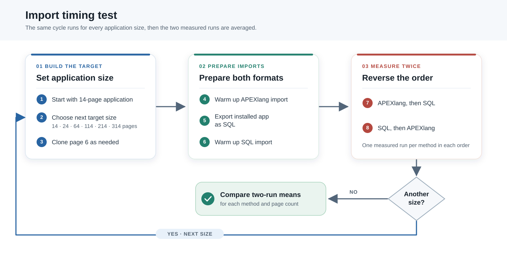
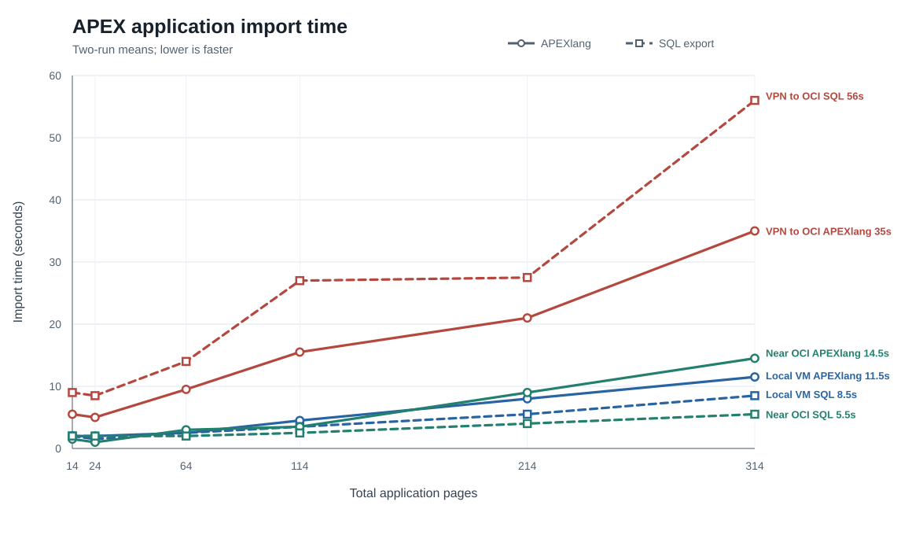
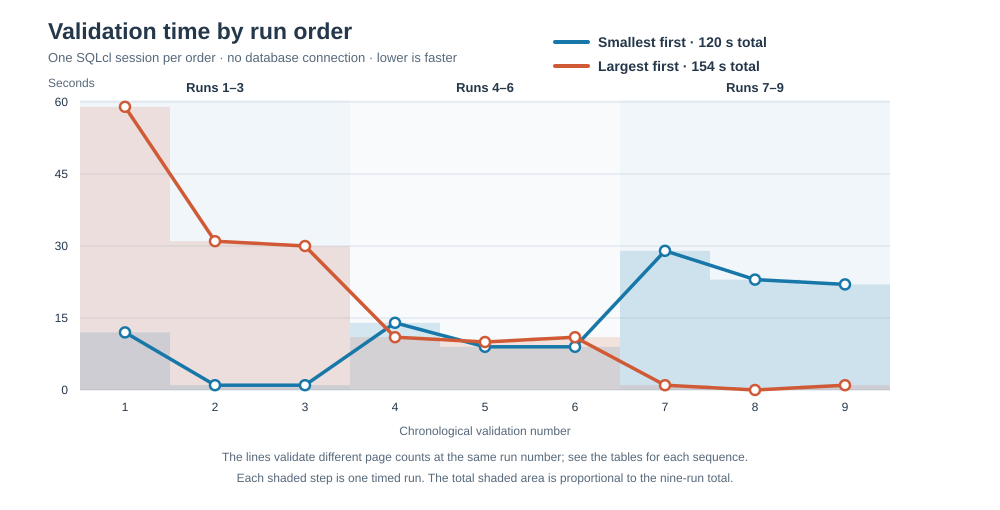

# APEXlang vs. SQL for APEX Deployment: Which Is Faster, and When?

## Contents

- [APEXlang vs. SQL for APEX Deployment: Which Is Faster, and When?](#apexlang-vs-sql-for-apex-deployment-which-is-faster-and-when)
  - [Contents](#contents)
  - [TL;DR](#tldr)
  - [1. Why Compare the Two Paths?](#1-why-compare-the-two-paths)
  - [2. Test Databases and Application](#2-test-databases-and-application)
    - [2.1. Databases and Client Paths](#21-databases-and-client-paths)
    - [2.2. Demo Application](#22-demo-application)
  - [3. A Toolkit for Timing, Tracing, and Validation](#3-a-toolkit-for-timing-tracing-and-validation)
    - [3.1. Timing aliases: one elapsed time for the whole import](#31-timing-aliases-one-elapsed-time-for-the-whole-import)
    - [3.2. Python page cloner: change application size](#32-python-page-cloner-change-application-size)
    - [3.3. Benchmark runner: repeat the same sequence](#33-benchmark-runner-repeat-the-same-sequence)
    - [3.4. Trace helper: inspect database work](#34-trace-helper-inspect-database-work)
    - [3.5. No-connection validation timer](#35-no-connection-validation-timer)
  - [4. Test I: What Does Each Import Do in the Database?](#4-test-i-what-does-each-import-do-in-the-database)
    - [4.1. Design and Methodology](#41-design-and-methodology)
    - [4.2. Implementation and Evidence](#42-implementation-and-evidence)
    - [4.3. Performance Comparison](#43-performance-comparison)
  - [5. Test II: Does SQLcl's APEXlang Import Need ORDS?](#5-test-ii-does-sqlcls-apexlang-import-need-ords)
  - [6. Test III: Which Way Is Faster?](#6-test-iii-which-way-is-faster)
    - [6.1. Test Design and Methodology](#61-test-design-and-methodology)
    - [6.2. Implementation and Evidence](#62-implementation-and-evidence)
    - [6.3. Performance Comparison](#63-performance-comparison)
  - [7. Test IV: Does Execution Order Matter?](#7-test-iv-does-execution-order-matter)
    - [7.1. Design and Methodology](#71-design-and-methodology)
    - [7.2. Implementation](#72-implementation)
    - [7.3. Evidence](#73-evidence)
    - [7.4. Performance Comparison](#74-performance-comparison)
  - [8. Conclusions](#8-conclusions)
    - [8.1. Conclusions](#81-conclusions)
    - [8.2. Recommendations](#82-recommendations)
    - [8.3. Next Steps and Reproducibility](#83-next-steps-and-reproducibility)
  - [9. Acknowledgements](#9-acknowledgements)
  - [10. Reference Materials](#10-reference-materials)

## TL;DR

SQLcl Project 26.2.2 offers an `apex.apexlang` option that lets a project deploy an APEX application from APEXlang files instead of its conventional SQL export. Direct APEXlang deployment with SQLcl's `apex import` command was already available in SQLcl 26.1. More people now have a reason to ask: which way is faster?

In my tests, the conventional SQL export imported faster when SQLcl ran close to the database. APEXlang imported faster when SQLcl reached the remote OCI database through a VPN. At 314 pages, the VPN averages were **35 seconds for APEXlang and 56 seconds for SQL**; with SQLcl near that same database, they were **14.5 and 5.5 seconds**. The database traces suggest why: APEXlang sent fewer calls from SQLcl to the database, but made the database do more work inside those calls.

Disconnected APEXlang validation also showed a substantial first-use cost. Running smaller applications first in one SQLcl session saved **22%** across nine validations compared with running the same sizes largest first.

I built a [small set of scripts](../../apexlang-vs-sql-perftest/) to investigate this: SQLcl aliases that time imports, a Python script that copies pages, runners that repeat the tests, a trace script, and a way to time APEXlang validation without a database connection. Others can use them to investigate their own APEX applications.

## 1. Why Compare the Two Paths?

SQLcl Project 26.2.2 can deploy an APEX application from APEXlang files when the `apex.apexlang` setting is enabled. That gives us two deployment paths: APEXlang and the conventional SQL export. Oracle lists APEXlang support in the [SQLcl 26.2 release notes](https://www.oracle.com/tools/sqlcl/sqlcl-relnotes-26.2.html).

You now have a choice. Here I compare the two commands you can use to install your application:

```sql
-- APEXlang source directory
apex import -input src/database/demo1/apex_apps/f106/demo1

-- Conventional generated APEX application export
@src/database/demo1/apex_apps/f106/f106.sql
```

**Which one is faster?**

I tested how the answer changes with the number of application pages, where SQLcl runs, the network path to the database, and the order of operations within a SQLcl session. I also examined database traces to see how the two paths use the database. The results should help you choose a deployment format for your own setup.

I developed several scripts for these tests. You can [download the ZIP](../../apexlang-vs-sql-perftest/zip/apexlang-vs-sql-perftest.zip) and repeat the tests in your own environment. All the tools are also available in the [source project](../../apexlang-vs-sql-perftest/); feel free to use or modify them for your application.

For more about the commands, see the [SQLcl APEXlang command reference](https://docs.oracle.com/en/database/oracle/sql-developer-command-line/26.1/sqcug/apexlang.html) and [Oracle's guide to using SQLcl with APEXlang](https://docs.oracle.com/en/database/oracle/apex/26.1/apxdc/using-sqlcl-apexlang.html).

## 2. Test Databases and Application

### 2.1. Databases and Client Paths

I used two databases: one in a local VM on my workstation and one in Oracle Cloud Infrastructure (OCI). The database and APEX versions, along with the resources observed during the tests, were:

| Property | Local VM on my workstation | Remote OCI database |
|---|---:|---:|
| Database | Oracle AI Database 26ai Free, release 23.26.1 | Oracle database, release 23.26.0 |
| APEX | 26.1.0 | 26.1.1 |
| CPU count | 2 | 4 |
| Physical memory | 3.82 GiB | 31.06 GiB |
| Allocated SGA observed | 1,529 MiB | 14,825 MiB |
| PGA aggregate target | 512 MiB | 3,712 MiB |

I ran SQLcl 26.2 in three ways:

| SQLcl client | Client operating system | Database connection |
|---|---|---|
| My workstation | Windows 11 | Local VM database |
| My workstation | Windows 11 | Remote OCI database through a VPN |
| OCI host reached by SSH | Oracle Linux 9 (`x86_64`) | Same remote OCI database, with the SQLcl client nearby |

The resource numbers describe the two database systems; they were not measured during every import. The remote OCI database had more memory than the local VM.

### 2.2. Demo Application

I used a small APEX application I had built for another demo: application **106, EMP & DEPT Mini Hub**. Its workspace and schema were both `DEMO1`, and it had 14 pages. To vary its size, I wrote a Python script that reads its APEXlang page files on my local filesystem and clones page 6, giving each copy a new page number, alias, and report ID. The next section introduces that script and the rest of the tools.

> **This is what makes APEXlang so useful for an experiment like this:** I can scale the application with a script, then test how its size affects deployment time. The editable APEXlang files make this test practical without rebuilding hundreds of pages by hand. Even when a SQL export imports faster, APEXlang gives me a new and powerful way to investigate the application and run repeatable tests.

## 3. A Toolkit for Timing, Tracing, and Validation

The [test project](../../apexlang-vs-sql-perftest/) contains timing aliases, a page-copying script, an import benchmark runner, a trace script, and a separate runner for disconnected validation. I built them for this comparison, but the timing and trace tools can also be adapted to investigate other SQL and SQLcl operations, including APEX application loads and validations.

I use two ways to measure elapsed time:

- **With a database connection:** SQLcl aliases get a database timestamp before and after an import. I use these for most of the import tests.
- **Without a database connection:** Shell commands record the time before and after `apex validate` in a `sql -nolog` session. I use this method in Test IV.

The examples below use captured SQLcl output. I link to the saved log where one is available.

### 3.1. Timing aliases: one elapsed time for the whole import

`SET TIMING ON` did not give me the measurement I needed. For `apex import`, SQLcl printed no elapsed time for the command at all:

```text
SQL> set timing on
SQL> apex import -input src/database/demo1/apex_apps/f106/demo1
Importing application ID: 106 into workspace: DEMO1
Import successful.
```

For the conventional SQL export, SQLcl printed a time after each statement instead of one clear total. Here are the beginning and end of my captured output; the many component lines between them are omitted:

```text
SQL> set timing on
SQL> @src/database/demo1/apex_apps/f106/f106.sql
--application/set_environment
Elapsed: 00:00:01.186
APPLICATION 106 - EMP & DEPT Mini Hub
--application/delete_application
Elapsed: 00:00:05.901
--application/create_application
Elapsed: 00:00:01.024
```

```text
--application/end_environment
Elapsed: 00:00:01.260
...done
Elapsed: 00:00:01.266
SQL>
```

The last `Elapsed` line cannot be the whole import time: an earlier statement alone took 5.901 seconds. The trace of the 214-page SQL import recorded 507 SQL statements from the user session. I needed one time for the whole import, not hundreds of separate times.

I therefore created [`test_al_load` and `test_sql_load`](../../apexlang-vs-sql-perftest/scripts/xml/stel-timing-aliases.xml). This is the SQL body of `test_al_load` as stored in the alias file. It records a database timestamp, runs the APEXlang import, then prints the elapsed time:

```sql
set define on
set verify off
set timing off
column apexlang_path new_value apexlang_path noprint
select :apexlang_path apexlang_path from dual;
column started_at new_value started_at noprint
select (sysdate - date '2026-01-01') * 86400 as started_at from dual;
prompt Importing APEXlang application from &apexlang_path. ...
apex import -input &apexlang_path.
set verify off
set define on
select 'Elapsed time: ' || to_char(
                     (sysdate - date '2026-01-01') * 86400 - &started_at
                 , 'FM999999990D000') || ' seconds' as elapsed_time
    from dual;
set define off
```

Load both aliases in SQLcl before calling them directly:

```sql
alias load scripts/xml/stel-timing-aliases.xml
```

Here is a complete captured invocation of the APEXlang alias:

```text
SQL> test_al_load  src/database/demo1/apex_apps/f106/demo1


1 row selected.


1 row selected.

Importing APEXlang application from src/database/demo1/apex_apps/f106/demo1 ...
Importing application ID: 106 into workspace: DEMO1
Import successful.


ELAPSED_TIME
------------------------------------
Elapsed time: 2.000 seconds

1 row selected.
```

The SQL alias printed the script name, many component lines, `...done`, and then its own total. These are the beginning and end of a captured invocation; only the middle component lines are omitted:

```text
SQL> test_sql_load  src/database/demo1/apex_apps/f106/f106


1 row selected.


1 row selected.

Running SQL script src/database/demo1/apex_apps/f106/f106 ...
--application/set_environment
APPLICATION 106 - EMP & DEPT Mini Hub
--application/delete_application
--application/create_application
```

```text
--application/end_environment
...done

ELAPSED_TIME
------------------------------------
Elapsed time: 3.000 seconds

1 row selected.

SQL>
```

Each alias asks the database for the time before and after the import. The difference includes work done by SQLcl and time spent communicating with the database. `SYSDATE` counts whole seconds: `.000` in the output is formatting, **not millisecond precision**. More precise timing would help compare the smallest runs, but the aliases give me the missing total.

### 3.2. Python page cloner: change application size

The [Python script](../../apexlang-vs-sql-perftest/scripts/apex/clone_apex_page.py) works directly with the application's APEXlang page files. You give it a source page number and a target number of clones. It copies `p00006-departments.apx` into new page files, giving each copy a new page number, alias, and saved-report ID while keeping the file's LF line endings. For example, one benchmark cycle requested 10 clones of page 6:

```bash
python scripts/apex/clone_apex_page.py 6 10
```

The [captured output](../../apexlang-vs-sql-perftest/var/apex_timing_test/apex-import-timing-local-vm.log) shows the generated file names (middle lines omitted):

```text
Created demo1\pages\p02001-departments-2001.apx
Created demo1\pages\p02002-departments-2002.apx
Created demo1\pages\p02003-departments-2003.apx
...
Created demo1\pages\p02010-departments-2010.apx
```

The target is the **total number of clones to keep**, not the number to add on this run. If I raise it, the script adds missing pages; if I lower it, the script removes excess clones. In the [largest-first validation log](../../apexlang-vs-sql-perftest/var/apex_validate_nolog_test/apex_validate_nolog-600-300-0.log), the target dropped from 300 clones to 0. The output included (middle lines omitted):

```text
Removed demo1\pages\p02001-departments-2001.apx
Removed demo1\pages\p02002-departments-2002.apx
...
Removed demo1\pages\p02300-departments-2300.apx
Done. Created 0 and removed 300 page(s) for a target of 0 clone(s) from page 6.
```

This was my first script that generated APEXlang files directly. Changing one number now lets me scale the same application up or down across several tests—one of the most useful things APEXlang makes possible.

### 3.3. Benchmark runner: repeat the same sequence

The [Bash runner](../../apexlang-vs-sql-perftest/scripts/run_apex_timing_test.sh) starts SQLcl, loads the timing aliases, and calls the [SQL test script](../../apexlang-vs-sql-perftest/scripts/sql/apex_timing_test.sql). Another SQL script runs each page-count cycle. The runner saves output from both SQLcl and Python with `tee`; SQLcl `spool` did not capture the Python output in this test.

```bash
bash scripts/run_apex_timing_test.sh <saved_sqlcl_connection> <workspace>
```

The opening of the [local-VM log](../../apexlang-vs-sql-perftest/var/apex_timing_test/apex-import-timing-local-vm.log) confirms the connection, aliases, and application paths before the cycles begin:

```text
SQLcl: Release 26.2 Production on Thu Sep 10 22:01:48 2026
Connected.
Aliases Loaded
================================================================
Confirming test variables
================================================================
test_app_id    = 106
test_app_alias = demo1
test_al_dir    = src/database/demo1/apex_apps/f106/demo1
test_sql_dir   = src/database/apex_apps/f106
```

Run it from the extracted project's root in an isolated test workspace. It repeatedly **replaces application 106** and uses `git clean -fd` in the generated APEX paths.

### 3.4. Trace helper: inspect database work

I wanted to look under the hood: which database statements does each import run, and how often? I captured a trace for each import and used **TKPROF** to read it. TKPROF summarizes the statements and their parse, execute, and fetch counts, which I compare below. Oracle documents the tool in [Performing Application Tracing](https://docs.oracle.com/en/database/oracle/oracle-database/26/tgsql/performing-application-tracing.html). Tracing has to be turned on for the connection that runs the import.

I connected as `DEMO1`. The user running the trace script needs DBA privileges or a DBA must grant that user access to `DBMS_MONITOR`. For my test, a DBA ran:

```sql
grant execute on dbms_monitor to demo1;
```

If the grant is only needed for this test, a DBA can revoke it afterward:

```sql
revoke execute on dbms_monitor from demo1;
```

Pass `APEXLANG` or `SQL` to the [trace script](../../apexlang-vs-sql-perftest/scripts/sql/apex_import_trace.sql). It turns tracing on, runs the matching timing alias, turns tracing off, and prints the trace-file path. Reconnect before testing the other method so each import has its own database session.

These selected lines from a later run show the APEXlang command, its trace identifier, and the file reported after the import. SQLcl's blank lines and row-count messages are omitted:

```text
SQL> @scripts/sql/apex_import_trace.sql APEXLANG
Trace identifier: APEX106_APEXLANG_214P_20260917_150317
Session altered.
PL/SQL procedure successfully completed.
Importing APEXlang application from src/database/demo1/apex_apps/f106/demo1 ...
Importing application ID: 106 into workspace: DEMO1
Import successful.
ELAPSED_TIME
------------------------------------
Elapsed time: 8.000 seconds
PL/SQL procedure successfully completed.
TRACE_FILE
----------------------------------------------------------------------------------------------------------------------------------------------------------------
/opt/oracle/diag/rdbms/free/FREE/trace/FREE_ora_51445_APEX106_APEXLANG_214P_20260917_150317.trc
```

The `SQL` argument follows the same steps. I have omitted its long list of application components, while preserving the output lines below:

```text
SQL> @scripts/sql/apex_import_trace.sql SQL
Trace identifier: APEX106_SQL_214P_20260917_150410
Session altered.
PL/SQL procedure successfully completed.
Running SQL script src/database/demo1/apex_apps/f106/f106 ...
--application/set_environment
APPLICATION 106 - EMP & DEPT Mini Hub
--application/end_environment
...done
ELAPSED_TIME
------------------------------------
Elapsed time: 2.000 seconds
PL/SQL procedure successfully completed.
TRACE_FILE
----------------------------------------------------------------------------------------------------------------------------------------------------------------
/opt/oracle/diag/rdbms/free/FREE/trace/FREE_ora_51445_APEX106_SQL_214P_20260917_150410.trc
```

The identifier tells me which application, method, and page count the trace belongs to, and when it ran. `TRACE_FILE` is the path **on the database host**. TKPROF reads that file and writes a `.prf` report. These 8-second and 2-second examples show how to run the script. The [APEXlang](../../apexlang-vs-sql-perftest/var/trace/apex106_apexlang.prf) and [SQL](../../apexlang-vs-sql-perftest/var/trace/apex106_sql.prf) reports discussed next came from an earlier test.

### 3.5. No-connection validation timer

The import aliases ask the database for timestamps, so they cannot time `apex validate` in a session started with `sql -nolog`. I used scripts with arguments instead of aliases for this test: the [Bash runner](../../apexlang-vs-sql-perftest/scripts/run_apex_validate_nolog.sh) starts SQLcl and saves its output; the [main SQL script](../../apexlang-vs-sql-perftest/scripts/sql/apex_validate_nolog.sql) chooses the page counts and repeats each validation three times; and the [step script](../../apexlang-vs-sql-perftest/scripts/sql/apex_validate_nolog_step.sql) clones pages and measures one validation.

The step script runs separate shell commands before and after `apex validate`. It stores the start time in `/tmp/start_time` so the second command can read it. The timer surrounds only validation; page cloning happens before it:

```sql
! bash -c "date +%s >/tmp/start_time"
apex validate -input &apexlang_path.
! bash -c "echo \"Elapsed $(($(date +%s) - $(cat /tmp/start_time))) seconds\"; rm /tmp/start_time"
```

These are whole-second wall-clock times. [Test IV](#7-test-iv-does-execution-order-matter) shows what the timer revealed.

> **Run the tests yourself.** I developed these tools for this investigation. Download the [test ZIP](../../apexlang-vs-sql-perftest/zip/apexlang-vs-sql-perftest.zip), extract it, and run the scripts from its project root in an isolated copy. The runners use `git clean` in the generated APEX paths.
>
> - **Tools:** Git, Bash, Python 3.9 or later, and SQLcl 26.2. I used Python 3.14 on Windows 11 and Python 3.9 on Oracle Linux 9; no specific Git or Bash version is required.
> - **Import and trace tests:** A saved SQLcl connection to a database with APEX 26.1 or later and access to the test workspace. The trace test also needs TKPROF and access to the database trace files, as described above.
> - **Disconnected validation:** SQLcl runs with `sql -nolog`; no database connection is needed.
> - **Platforms:** I ran the tools on Windows 11 and Oracle Linux 9. They should also work on macOS, although I have not tested that platform.

## 4. Test I: What Does Each Import Do in the Database?

> **Purpose:** See what each import runs inside the database. Which method makes more calls, which APEX routines do they share, and what extra work does APEXlang perform?

### 4.1. Design and Methodology

I ran this test against my **local VM database**, where I had access to the server's trace files. As shown in [section 2.1](#21-databases-and-client-paths), it was Oracle AI Database 26ai Free (release 23.26.1) with APEX 26.1.0, two CPUs, and 3.82 GiB of memory. I used the trace script to capture an APEXlang import and a SQL import, then checked their database trace files with TKPROF to compare the statements they ran.

### 4.2. Implementation and Evidence

I first used the Python script to clone page 6 another 200 times, bringing application 106 from 14 to 214 pages:

```bash
python scripts/apex/clone_apex_page.py 6 200
```

The beginning and end of the command output show the new page files. The middle file lines are omitted:

```text
Created demo1\pages\p02001-departments-2001.apx
Created demo1\pages\p02002-departments-2002.apx
Created demo1\pages\p02003-departments-2003.apx
```

```text
Created demo1\pages\p02197-departments-2197.apx
Created demo1\pages\p02198-departments-2198.apx
Created demo1\pages\p02199-departments-2199.apx
Created demo1\pages\p02200-departments-2200.apx
Done. Created 200 page(s) from page 6.
```

I then started SQLcl without logging in and ran this sequence. The first trace imported the APEXlang files. **After that import, I exported the installed application as SQL**, so the SQL file included the 200 new pages. I disconnected before tracing the SQL import, giving each method its own database session:

```sql
alias load scripts/xml/stel-timing-aliases.xml
conn -n <saved_sqlcl_connection>
@scripts/sql/apex_import_trace.sql APEXLANG
apex export -applicationid &test_app_id -exptype SQL -dir &test_sql_dir -overwrite-files -force
disconnect
conn -n <saved_sqlcl_connection>
@scripts/sql/apex_import_trace.sql SQL
```

The SQL export reported the refreshed file:

```text
Exporting Workspace DEMO1 - application 106:EMP & DEPT Mini Hub
File src\database\demo1\apex_apps\f106\f106.sql created
```

With the client-side imports finished, I went to the trace directory on the database server. The listing shows two APEXlang trace pieces and one SQL trace file:

```text
[oracle@vbox ~]$ cd /opt/oracle/diag/rdbms/free/FREE/trace/
[oracle@vbox trace]$ ls -lt *APEX*.trc
-rw-r-----. 1 oracle oinstall 4305205 Sep 14 17:04 FREE_ora_7142_APEX106_SQL_600P_20260914.trc
-rw-r-----. 1 oracle oinstall 1567249 Sep 14 16:54 FREE_ora_6727_APEX106_APEXLANG_600P_20260914.trc
-rw-r-----. 1 oracle oinstall 6714523 Sep 14 16:52 FREE_ora_6727_APEX106_APEXLANG_600P_20260914_1.trc
```

Oracle may split a trace across files. Use `cat` to combine them in the order they were written. In this case, `_1.trc` came before the unnumbered `.trc` file:

```bash
[oracle@vbox trace]$ cat   FREE_ora_6727_APEX106_APEXLANG_600P_20260914_1.trc   FREE_ora_6727_APEX106_APEXLANG_600P_20260914.trc   > APEX106_APEXLANG_COMPLETE.trc
```

I ran TKPROF on that combined file. The output report is `apex106_apexlang_complete.prf`: `complete` indicates that it includes both trace pieces. `aggregate=yes` groups repeated executions of the same statement, and `waits=yes` includes wait information. The command and server output were:

```text
[oracle@vbox trace]$ tkprof   APEX106_APEXLANG_COMPLETE.trc   apex106_apexlang_complete.prf   sys=no aggregate=yes waits=yes

TKPROF: Release 23.0.0.0.0 - Development on Thu Sep 17 15:45:37 2026

Copyright (c) 1982, 2026, Oracle and/or its affiliates.  All rights reserved.

[oracle@vbox trace]$ ls -lt apex106_apexlang_complete.prf
-rw-rw-r--. 1 oracle oracle 4611424 Sep 17 15:45 apex106_apexlang_complete.prf
```

The [APEXlang report](../../apexlang-vs-sql-perftest/var/trace/apex106_apexlang.prf) and [SQL report](../../apexlang-vs-sql-perftest/var/trace/apex106_sql.prf) are available with the test files.

TKPROF labels commands sent from SQLcl **non-recursive** and extra SQL the database runs while handling them **recursive**. I call the first group **foreground** calls in the comparison table. Here are both overall summary tables: 

**APEXlang report:**

```text
OVERALL TOTALS FOR ALL NON-RECURSIVE STATEMENTS

call     count       cpu    elapsed       disk      query    current        rows
------- ------  -------- ---------- ---------- ---------- ----------  ----------
Parse       51      0.11       0.17          2         77          0           0
Execute     52      1.23       1.77          3         78          0          44
Fetch        8      0.01       0.01          0         32          0           8
------- ------  -------- ---------- ---------- ---------- ----------  ----------
total      111      1.35       1.96          5        187          0          52

Misses in library cache during parse: 7
Misses in library cache during execute: 2

Elapsed times include waiting on following events:
  Event waited on                             Times   Max. Wait  Total Waited
  ----------------------------------------   Waited  ----------  ------------
  SQL*Net message to client                      52        0.00          0.00
  SQL*Net message from client                    52      136.57        325.62
  Allocate UGA memory from OS                    29        0.00          0.00
  Allocate CGA memory from OS                    55        0.00          0.00
  Allocate PGA memory from OS                    17        0.00          0.00
  Free private memory to OS                       4        0.00          0.00
  SQL*Net more data from client                  33        0.04          0.12

OVERALL TOTALS FOR ALL RECURSIVE STATEMENTS

call     count       cpu    elapsed       disk      query    current        rows
------- ------  -------- ---------- ---------- ---------- ----------  ----------
Parse     4879      1.12       1.82          0        227          0           0
Execute  15097      8.01      11.68        637       6279      97016        5968
Fetch     9297      0.32       0.50          2      25849          4       15139
------- ------  -------- ---------- ---------- ---------- ----------  ----------
total    29273      9.46      14.00        639      32355      97020       21107

Misses in library cache during parse: 518
Misses in library cache during execute: 498

Elapsed times include waiting on following events:
  Event waited on                             Times   Max. Wait  Total Waited
  ----------------------------------------   Waited  ----------  ------------
  Allocate UGA memory from OS                   101        0.00          0.00
  db file sequential read                        92        0.01          0.20
  Allocate CGA memory from OS                   292        0.00          0.01
  Allocate PGA memory from OS                     7        0.00          0.00
  Allocate DGA memory from OS                     1        0.00          0.00
  Disk file operations I/O                        3        0.00          0.00
  db file parallel read                         498        0.00          0.06
  db file scattered read                          6        0.01          0.01
  direct path write                               9        0.00          0.02
  flashback log file sync                         3        0.01          0.01
```


**SQL import report:**

```text
OVERALL TOTALS FOR ALL NON-RECURSIVE STATEMENTS

call     count       cpu    elapsed       disk      query    current        rows
------- ------  -------- ---------- ---------- ---------- ----------  ----------
Parse      265      1.79       4.78          0      16860          0           0
Execute    266      0.45       1.09          0        243          0         263
Fetch        3      0.00       0.00          0          0          0           3
------- ------  -------- ---------- ---------- ---------- ----------  ----------
total      534      2.24       5.88          0      17103          0         266

Misses in library cache during parse: 248
Misses in library cache during execute: 15

Elapsed times include waiting on following events:
  Event waited on                             Times   Max. Wait  Total Waited
  ----------------------------------------   Waited  ----------  ------------
  SQL*Net message to client                     265        0.00          0.00
  SQL*Net message from client                   265       25.49         53.77
  Allocate CGA memory from OS                  5529        0.00          0.06
  Allocate UGA memory from OS                    11        0.00          0.00
  Free private memory to OS                     216        0.00          0.06
  Allocate PGA memory from OS                  2815        0.00          0.02
  SQL*Net more data from client                  10        0.00          0.00
  latch: shared pool                              1        0.06          0.06

OVERALL TOTALS FOR ALL RECURSIVE STATEMENTS

call     count       cpu    elapsed       disk      query    current        rows
------- ------  -------- ---------- ---------- ---------- ----------  ----------
Parse      626      0.01       0.02          0         60          0           0
Execute   6466      0.94       1.78        529       2799      94388        4924
Fetch     1448      0.08       0.17          0       5453          0        4356
------- ------  -------- ---------- ---------- ---------- ----------  ----------
total     8540      1.05       1.99        529       8312      94388        9280

Misses in library cache during parse: 4
Misses in library cache during execute: 15

Elapsed times include waiting on following events:
  Event waited on                             Times   Max. Wait  Total Waited
  ----------------------------------------   Waited  ----------  ------------
  Allocate CGA memory from OS                     1        0.00          0.00
  Allocate UGA memory from OS                   131        0.00          0.00
  asynch descriptor resize                        1        0.00          0.00
  Disk file operations I/O                        3        0.00          0.00
  db file scattered read                          7        0.00          0.00
  db file parallel read                         466        0.00          0.03
  Allocate PGA memory from OS                    12        0.00          0.00
  Allocate DGA memory from OS                     1        0.00          0.00
  direct path write                               7        0.00          0.02
  db file sequential read                         4        0.00          0.01
```

### 4.3. Performance Comparison

With the source numbers visible, the differences are easier to compare:

| TKPROF metric, 214-page import | APEXlang | SQL import |
|---|---:|---:|
| Foreground parse calls | 51 | 265 |
| Foreground execute calls | 52 | 266 |
| Foreground fetch calls | 8 | 3 |
| **All foreground calls** | **111** | **534** |
| `SQL*Net message to client` events | 52 | 265 |
| `SQL*Net message from client` events | 52 | 265 |
| Foreground CPU | 1.35 s | 2.24 s |
| Foreground elapsed | 1.96 s | 5.88 s |
| Recursive parse calls | 4,879 | 626 |
| Recursive execute calls | 15,097 | 6,466 |
| Recursive fetch calls | 9,297 | 1,448 |
| **All recursive calls** | **29,273** | **8,540** |
| **All foreground and recursive calls** | **29,384** | **9,074** |
| Recursive CPU | 9.46 s | 1.05 s |
| Recursive elapsed | 14.00 s | 1.99 s |
| **Approximate database-accounted SQL elapsed** | **15.96 s** | **7.87 s** |

The last row adds foreground and recursive elapsed time from the two TKPROF summaries. It is an approximate total of the recorded SQL call time, **not** the wall-clock time of the whole import.

Both reports show familiar APEX import routines such as `wwv_flow_imp_page.create_page`, `create_page_item`, and `create_page_process`. The APEXlang report also shows `wwv_imp_util.create_id`, `wwv_imp_util.get_reference_id`, and `wwv_flow_imp_page.create_apexlang_worksheet_col`. APEXlang uses the first two routines to create component IDs and look up references to them. The SQL export already contains those IDs and the PL/SQL calls that create the components.

These single traced imports took **37 seconds for APEXlang** and **12 seconds for SQL** on the local VM. They are separate from the repeated timing test later in the article. The trace itself, work done on the first import, and what was already cached can affect a single run. TKPROF reports what happened in the database connection; it does not measure SQLcl's CPU use. The `SQL*Net message from client` wait time includes time the server spent waiting for the client, so it is not the import's elapsed time. Oracle describes this as an [idle wait](https://docs.oracle.com/en/database/oracle/oracle-database/26/tgdba/instance-tuning-using-performance-views.html).

> **Findings from Test I on the local VM:**
>
> - **About 5.1× fewer client/server exchanges with APEXlang:** 52 server-to-client message events versus 265 for SQL. 
> - **About 3.2× more database calls with APEXlang:** 29,384 versus 9,074 foreground and recursive Parse, Execute, and Fetch calls combined. Both methods use APEX component-creation routines; much of APEXlang's extra work appears tied to creating and looking up component IDs.
> - **APEXlang spent about twice as long (2.03×) executing SQL in the database:** 15.96 versus 7.87 seconds in this local VM trace.

## 5. Test II: Does SQLcl's APEXlang Import Need ORDS?

> **Purpose:** Find out whether SQLcl needs ORDS running to import APEXlang, and whether stopping ORDS changes the import work seen in the database trace.

Oracle's [APEX 26.1 installation requirements](https://docs.oracle.com/en/database/oracle/apex/26.1/htmig/apex-installation-requirements.html) call for ORDS 26.1.1 or later. Importing APEXlang through [App Builder](https://docs.oracle.com/en/database/oracle/apex/26.1/htmdb/importing-export-files.html) also requires ORDS to be running. That can create confusion about SQLcl imports. Oracle's [SQLcl documentation](https://docs.oracle.com/en/database/oracle/sql-developer-command-line/26.1/sqcug/commands-overview-apexlang.html) says `apex import` compiles APEXlang and runs the resulting PL/SQL through the current database connection. For this SQLcl workflow, the Oracle Net (SQL*Net) database connection is enough; ORDS is outside the import path.

I ran the same 214-page APEXlang import from SQLcl on my local VM, once with ORDS running and once with ORDS stopped. Both imports succeeded. Their traces showed the same 69 top-level PL/SQL blocks and 2,225 `wwv_imp_util.create_id` occurrences. The runs took 37 and 31 seconds, respectively; those two runs do not establish a performance effect from stopping ORDS.

> **Finding:** ORDS can be stopped while SQLcl imports APEXlang over its database connection. The key APEX import routines in the two traces matched. Stopping ORDS can keep the application unavailable through that ORDS service during deployment; other database access paths remain available.

## 6. Test III: Which Way Is Faster?

> **Purpose:** Test how the deployment client's location and the network path to the database affect APEXlang and SQL import times as the application grows. Compare SQLcl over the VPN with SQLcl near the same OCI database, using the local VM as another reference point.

### 6.1. Test Design and Methodology

The diagram shows the cycle I repeated for each application size:

- Start with the 14-page application, then add 10, 50, 100, 200, or 300 copies of page 6. The six total sizes are **14, 24, 64, 114, 214, and 314 pages**.
- Run an APEXlang import once to warm it up, then export the installed application as SQL so both formats contain the same pages.
- Run the SQL import once to warm it up.
- Measure APEXlang followed by SQL, then reverse the order and measure SQL followed by APEXlang.
- Repeat the cycle at the next size and compare the two measured times for each method.



For each method and page count, I **discarded the first import** as a warm-up and averaged imports **two and three**. This reduces the impact of first-use work on the comparison. I reversed the measured order so neither method always ran first. Each run replaced the **same existing application** in the workspace; the imports did not accumulate pages in the database. All three client setups used the same page counts and sequence.

### 6.2. Implementation and Evidence

From the extracted project's root, run the [Bash runner](../../apexlang-vs-sql-perftest/scripts/run_apex_timing_test.sh) with a saved SQLcl connection name and an APEX workspace name:

```shell
$ scripts/run_apex_timing_test.sh <saved_connection_name> <apex_workspace>
```

For example, I ran the local VM test with:

```shell
$ scripts/run_apex_timing_test.sh demo_vm26 demo1
```

On Linux or macOS, if the script is not executable, run `chmod u+x scripts/run_apex_timing_test.sh` first. The runner starts SQLcl without a connection, connects using the saved connection, selects the workspace, loads the timing aliases, and runs the [main SQL script](../../apexlang-vs-sql-perftest/scripts/sql/apex_timing_test.sql). After the connection is ready, these six lines in the main script drive the page-count cycles:

```sql
@@apex_timing_test_step.sql 0
@@apex_timing_test_step.sql 10
@@apex_timing_test_step.sql 50
@@apex_timing_test_step.sql 100
@@apex_timing_test_step.sql 200
@@apex_timing_test_step.sql 300
```

Each argument sets the **target number of cloned pages** to keep. With the original 14 pages, those targets produce applications of 14, 24, 64, 114, 214, and 314 pages. In each cycle, the [step script](../../apexlang-vs-sql-perftest/scripts/sql/apex_timing_test_step.sql) adjusts the page files to that target, runs the warm-up APEXlang import, exports the installed application as SQL, runs the warm-up SQL import, and then measures both orders. The local VM log shows those steps for the first growth cycle; only the step markers are shown here:

```text
# CYCLE: extra pages = 10
### STEP: generate extra pages ###
### STEP: warm-up APEXLANG import ###
### STEP: export SQL file ###
### STEP: warm-up SQL import ###
### STEP: measured set 1 (APEXLANG, then SQL) ###
### STEP: measured set 2 (SQL, then APEXLANG - reversed order) ###
```

The runner saved the complete SQLcl and Python output for each client setup:

- [Local VM log](../../apexlang-vs-sql-perftest/var/apex_timing_test/apex-import-timing-local-vm.log): SQLcl on my Windows workstation connected to the local VM database.
- [VPN log](../../apexlang-vs-sql-perftest/var/apex_timing_test/apex-import-timing-remote-vpn.log): SQLcl on the workstation connected to the remote OCI database through the VPN.
- [OCI client log](../../apexlang-vs-sql-perftest/var/apex_timing_test/apex_import_timing-remote-oci.log): SQLcl on the Oracle Linux host near the same remote OCI database.

### 6.3. Performance Comparison

The table compares the **mean import time in seconds** from the two measured runs for each method and application size. Lower is faster. The client locations are:

- **VM:** SQLcl on my Windows 11 laptop accessing the database in its local VM.
- **VPN:** SQLcl on the same laptop accessing the remote OCI database through the VPN.
- **OCIWS:** SQLcl on an Oracle Linux workstation in OCI, near that same remote OCI database.

| Total pages | VM APEXlang | VM SQL | VPN APEXlang | VPN SQL | OCIWS APEXlang | OCIWS SQL |
|---:|---:|---:|---:|---:|---:|---:|
| 14 | 2.0 s | 2.0 s | 5.5 s | 9.0 s | 1.5 s | 2.0 s |
| 24 | 2.0 s | 1.5 s | 5.0 s | 8.5 s | 1.0 s | 2.0 s |
| 64 | 2.5 s | 2.5 s | 9.5 s | 14.0 s | 3.0 s | 2.0 s |
| 114 | 4.5 s | 3.5 s | 15.5 s | 27.0 s | 3.5 s | 2.5 s |
| 214 | 8.0 s | 5.5 s | 21.0 s | 27.5 s | 9.0 s | 4.0 s |
| 314 | 11.5 s | 8.5 s | 35.0 s | 56.0 s | 14.5 s | 5.5 s |

The following are selected lines from the **314-page measured sets** in the [VPN log](../../apexlang-vs-sql-perftest/var/apex_timing_test/apex-import-timing-remote-vpn.log). SQL's component output and unrelated SQLcl lines are omitted; the displayed lines themselves are unchanged:

```text
### STEP: measured set 1 (APEXLANG, then SQL) ###
Importing APEXlang application from src/database/demo1/apex_apps/f106/demo1 ...
Elapsed time: 35.000 seconds
Running SQL script src/database/apex_apps/f106/f106 ...
Elapsed time: 52.000 seconds
### STEP: measured set 2 (SQL, then APEXLANG - reversed order) ###
Running SQL script src/database/apex_apps/f106/f106 ...
Elapsed time: 60.000 seconds
Importing APEXlang application from src/database/demo1/apex_apps/f106/demo1 ...
Elapsed time: 35.000 seconds
```

On the [OCI workstation](../../apexlang-vs-sql-perftest/var/apex_timing_test/apex_import_timing-remote-oci.log), the same page-count cycle produced:

```text
### STEP: measured set 1 (APEXLANG, then SQL) ###
Importing APEXlang application from src/database/demo1/apex_apps/f106/demo1 ...
Elapsed time: 18.000 seconds
Running SQL script src/database/demo1/apex_apps/f106/f106 ...
Elapsed time: 6.000 seconds
### STEP: measured set 2 (SQL, then APEXLANG - reversed order) ###
Running SQL script src/database/demo1/apex_apps/f106/f106 ...
Elapsed time: 5.000 seconds
Importing APEXlang application from src/database/demo1/apex_apps/f106/demo1 ...
Elapsed time: 11.000 seconds
```

The chart makes the trend across page counts easier to see:



*Figure 1. Average of two import runs at each page count. Color identifies the test setup; solid lines show APEXlang and dashed lines show SQL. Lower is faster.*

> **Finding from Test III:**
>
> - **Database resources mattered much less than the network path in these tests.** With SQLcl close to each database, the small local VM (2 CPUs, 3.82 GiB of memory) and the larger OCI database (4 CPUs, 31.06 GiB) delivered broadly comparable import times. The VM was even faster for some APEXlang application sizes.
> - Moving SQLcl across the VPN while keeping the same OCI database slowed both imports, especially SQL. At 314 pages, SQL rose from 5.5 to 56 seconds; APEXlang rose from 14.5 to 35 seconds. APEXlang was faster at every tested size over the VPN.
> - This reversal is consistent with the database trace: APEXlang made about five times fewer client/server exchanges, giving network delay fewer opportunities to add time.
>
> The test shows that the client's network path matters; it does not separate latency from VPN overhead or other traffic.

## 7. Test IV: Does Execution Order Matter?

> **Purpose:** Find out whether APEXlang and SQL import times depend on where an import falls in a SQLcl session, whether opening a new session for each application costs time, and which application-size order is faster.

The first three imports of each method at **14 and 314 pages** were the warm-up run and the two measured runs. The 14-page cycle came first in a fresh SQLcl session; the 314-page cycle came after all the smaller sizes, within that same session. These are the times recorded in the [VM](../../apexlang-vs-sql-perftest/var/apex_timing_test/apex-import-timing-local-vm.log), [VPN](../../apexlang-vs-sql-perftest/var/apex_timing_test/apex-import-timing-remote-vpn.log), and [OCI workstation](../../apexlang-vs-sql-perftest/var/apex_timing_test/apex_import_timing-remote-oci.log) logs. Changes are in seconds; a negative value means the later import was faster.

**APEXlang import**

| Client path | Pages | First | Second | Third | Change 1→2 | Change 2→3 |
|---|---:|---:|---:|---:|---:|---:|
| VM | 14 | 13 s | 2 s | 2 s | −11 s | 0 s |
| VPN | 14 | 22 s | 6 s | 5 s | −16 s | −1 s |
| OCIWS | 14 | 18 s | 2 s | 1 s | −16 s | −1 s |
| VM | 314 | 21 s | 12 s | 11 s | −9 s | −1 s |
| VPN | 314 | 38 s | 35 s | 35 s | −3 s | 0 s |
| OCIWS | 314 | 21 s | 18 s | 11 s | −3 s | −7 s |

**SQL export import**

| Client path | Pages | First | Second | Third | Change 1→2 | Change 2→3 |
|---|---:|---:|---:|---:|---:|---:|
| VM | 14 | 4 s | 2 s | 2 s | −2 s | 0 s |
| VPN | 14 | 13 s | 10 s | 8 s | −3 s | −2 s |
| OCIWS | 14 | 3 s | 2 s | 2 s | −1 s | 0 s |
| VM | 314 | 12 s | 9 s | 8 s | −3 s | −1 s |
| VPN | 314 | 50 s | 52 s | 60 s | +2 s | +8 s |
| OCIWS | 314 | 11 s | 6 s | 5 s | −5 s | −1 s |

Across all six sizes and three client paths in Test III, the first APEXlang import was slower than **both** repeats in **16 of 18 cycles (89%)**. For SQL exports, that happened in **11 of 18 cycles (61%)**; the 314-page VPN SQL run even rose from 50 to 52 to 60 seconds. APEXlang has the clearer first-run pattern, but the 314-page rows show that it is not limited to the first import of a SQLcl session. That raised the next question: does the extra time appear during APEXlang validation, before any database work?

### 7.1. Design and Methodology

I tested APEXlang validation without a database connection. This separates SQLcl's APEXlang work from the database import. I compared two orders in separate, fresh SQLcl processes: **0 → 300 → 600** cloned pages and **600 → 300 → 0**. With the 14-page base application, those are **14 → 314 → 614** and **614 → 314 → 14** total pages. I validated each size three times before moving to the next, keeping SQLcl open throughout each nine-run sequence. Reversing the order reveals whether a larger application creates a new first-run cost and whether a smaller one can use work already done.

### 7.2. Implementation

On my Windows 11 workstation, I ran `apex validate` with SQLcl started as `sql -nolog`. The [Bash runner](../../apexlang-vs-sql-perftest/scripts/run_apex_validate_nolog.sh) accepts three target numbers of cloned pages and starts a fresh SQLcl process for each order. For each target, the [main script](../../apexlang-vs-sql-perftest/scripts/sql/apex_validate_nolog.sql) calls the [step script](../../apexlang-vs-sql-perftest/scripts/sql/apex_validate_nolog_step.sql) three times. The step script adjusts the page files before timing each validation.

From the extracted project's root, I ran:

```shell
$ scripts/run_apex_validate_nolog.sh 0 300 600
$ scripts/run_apex_validate_nolog.sh 600 300 0
```

### 7.3. Evidence

There was no database connection in either process. The [smallest-first log](../../apexlang-vs-sql-perftest/var/apex_validate_nolog_test/apex_validate_nolog-0-300-600.log) begins with a 12-second validation of the base application; the [largest-first log](../../apexlang-vs-sql-perftest/var/apex_validate_nolog_test/apex_validate_nolog-600-300-0.log) begins with a 59-second validation of the 614-page version. Selected output, with page-file messages and blank lines omitted, shows the start of each run:

```text
Validation 3 times for 0 pages
Validation successful.
Elapsed 12 seconds
Validation successful.
Elapsed 1 seconds
Validation successful.
Elapsed 1 seconds
```

```text
Validation 3 times for 600 pages
Validation successful.
Elapsed 59 seconds
Validation successful.
Elapsed 31 seconds
Validation successful.
Elapsed 30 seconds
```

I also ran the same tool with **200 cloned pages**, matching the **214-page application** used for the database trace in Test I:

```shell
$ scripts/run_apex_validate_nolog.sh 200 100 300
```

The [captured log](../../apexlang-vs-sql-perftest/var/apex_validate_nolog_test/apex_validate_nolog-200-100-300.log) begins:

```text
Validation 3 times for 200 pages
Validation successful.
Elapsed 23 seconds
Validation successful.
Elapsed 5 seconds
Validation successful.
Elapsed 5 seconds
```

The same SQLcl session then validated the smaller 114-page version in **3, 3, and 2 seconds**. After growing to 314 pages, its three times were **12, 7, and 7 seconds**: the first-run bump returned when the application grew.

That first disconnected validation took **23 seconds**. The [Test I trace comparison](#43-performance-comparison) reported a **37-second** APEXlang import and approximately **15.96 seconds** of database-accounted SQL time for a 214-page application. The arithmetic gap is about **21 seconds**; adding 23 and 15.96 gives about **39 seconds**, close to the observed 37. This points to substantial SQLcl-side compilation and validation time alongside database work. These are separate runs, so the figures are a useful timing budget rather than an exact breakdown of one import.

### 7.4. Performance Comparison

Each row below shows three validations of the **same** application size within one SQLcl process. The page count changes between rows, but SQLcl stays open. Times are whole seconds; `0 s` means the two shell timestamps fell in the same second, not that validation took no time.

**Smallest first: 14 → 314 → 614 pages**

| Total pages | First | Second | Third | Three-run total |
|---:|---:|---:|---:|---:|
| 14 | 12 s | 1 s | 1 s | 14 s |
| 314 | 14 s | 9 s | 9 s | 32 s |
| 614 | 29 s | 23 s | 22 s | 74 s |
| **All nine** | | | | **120 s** |

**Largest first: 614 → 314 → 14 pages**

| Total pages | First | Second | Third | Three-run total |
|---:|---:|---:|---:|---:|
| 614 | 59 s | 31 s | 30 s | 120 s |
| 314 | 11 s | 10 s | 11 s | 32 s |
| 14 | 1 s | 0 s | 1 s | 2 s |
| **All nine** | | | | **154 s** |

The chronological chart shows where the time was spent in each order:



*Figure 2. Each line covers the same three application sizes and three validations per size. The shaded steps are proportional to the total time over nine runs; the page counts at a given run number differ between the two lines.*

> **Findings from Test IV:**
>
> - The first APEXlang validation in a fresh SQLcl process took **12 seconds at 14 pages** or **59 seconds at 614 pages**, then fell sharply on repeat. The effect occurs without a database connection. The import logs show a related first-run pattern for APEXlang in **89% of cycles**, versus **61%** for SQL exports.
> - **Increasing application size brought a new timing bump; decreasing it did not.** Starting with 614 pages avoided a new bump at 314 and 14 pages. A separate 214 → 114 → 314-page run also saw the bump return only after the last increase. SQLcl appears to allocate more reusable resources when it encounters a larger APEXlang application, then reuse them for smaller ones.
> - **Smallest first saved 34 seconds, or 22%,** across the nine validations: **120 seconds versus 154 seconds**. For an APEXlang batch, I would keep one SQLcl session open and run smaller applications before larger ones. That avoids repeatedly starting SQLcl and spreads the first-use work across increasing application sizes.

## 8. Conclusions

### 8.1. Conclusions

An APEXlang import spends time validating files in SQLcl, executing work in the database, and exchanging requests across the network. The balance between those costs determines which deployment format is faster in these tests:

- **Network path changes the winner.** With SQLcl near a database, the SQL export generally became faster as the application grew. Across the VPN, APEXlang won at every tested size. At 314 pages against the same OCI database, the nearby client took **5.5 seconds for SQL versus 14.5 for APEXlang**; over the VPN, it took **56 seconds for SQL versus 35 for APEXlang**. The trace gives a reason for that reversal: APEXlang made **about 5.1 times fewer client/server exchanges**.
- **APEXlang asks more of the database.** It generated component IDs and resolved references that the SQL export already contained. In the 214-page local VM trace, APEXlang made **about 3.2 times more database Parse, Execute, and Fetch calls**. Its recorded SQL CPU totaled **10.81 versus 3.29 seconds** (about **3.3 times more**), and its approximate database-accounted SQL elapsed time was **15.96 versus 7.87 seconds** (about **twice as much**). Those are database measurements, not whole-import times.
- **ORDS is not required for a SQLcl APEXlang import.** The import needs an Oracle Net database connection and succeeded with ORDS stopped. `apex validate` also succeeded without a database connection. Disconnected validation measures a substantial local part of a cold APEXlang run; database work and network exchanges add to the import's overall cost.
- **SQLcl reuses work within a session.** The first APEXlang validation took longer, and increasing the application size brought a new timing bump. Repeated validations and smaller applications then benefited from work already done. Running the same nine validations **smallest first took 120 seconds versus 154 seconds largest first**, a **34-second (22%) saving**.

### 8.2. Recommendations

- If SQLcl can run near the database, consider the SQL export, especially for larger applications or when database CPU and elapsed time during deployment matter. If SQLcl must deploy across a high-latency path, consider APEXlang: fewer exchanges made it faster over the VPN in this test.
- Keep applications in **one SQLcl session** for a deployment batch so later operations can reuse work already done. For an APEXlang batch, stage **smaller applications before larger ones**; that was the faster order in the disconnected validation test.
- If the application must be unavailable through ORDS while it changes, stop ORDS during the SQLcl import. SQLcl still needs its database connection. Validation alone needs neither ORDS nor that connection.

### 8.3. Next Steps and Reproducibility

The limits of these measurements are:

1. Application size grew by cloning one page, so other mixes of APEX components could change the result.
2. Import averages use two measured runs at each size, rounded to whole seconds. Server load was not held constant, and the tests do not establish a universal network-latency cutoff.
3. I treated SQLcl as a black box: I did not measure network latency, Java heap allocation, or local compiler work separately. The VPN comparison includes any other overhead on that path.

A useful next test would time local validation, database execution, and network activity separately while recording SQLcl's Java resource use. The current results already show which choices mattered in these environments.

To repeat the tests, download and extract the [test project ZIP](../../apexlang-vs-sql-perftest/zip/apexlang-vs-sql-perftest.zip). It contains the runners, scripts, and three disconnected-validation logs. The [local VM](../../apexlang-vs-sql-perftest/var/apex_timing_test/apex-import-timing-local-vm.log), [VPN](../../apexlang-vs-sql-perftest/var/apex_timing_test/apex-import-timing-remote-vpn.log), and [nearby OCI](../../apexlang-vs-sql-perftest/var/apex_timing_test/apex_import_timing-remote-oci.log) import logs are also in the repository. Run the import runner from the extracted project's root with a saved SQLcl connection to a test schema and APEX workspace. The packaged scripts target application 106 in `DEMO1`; change those values for another application. For database tracing, use TKPROF and the permission described in [section 3.4](#34-trace-helper-inspect-database-work).

## 9. Acknowledgements

My thanks to my colleague [Fekrat El Wehedi](https://www.linkedin.com/in/fekratelwehedi/) for giving me access to the OCI workstation used in these tests.

## 10. Reference Materials

Oracle documentation and presentation used in this article:

- [SQLcl 26.2 release notes](https://www.oracle.com/tools/sqlcl/sqlcl-relnotes-26.2.html)
- [SQLcl APEXlang command reference](https://docs.oracle.com/en/database/oracle/sql-developer-command-line/26.1/sqcug/apexlang.html)
- [SQLcl APEXlang commands overview](https://docs.oracle.com/en/database/oracle/sql-developer-command-line/26.1/sqcug/commands-overview-apexlang.html)
- [Using SQLcl with APEXlang](https://docs.oracle.com/en/database/oracle/apex/26.1/apxdc/using-sqlcl-apexlang.html)
- [Oracle APEX 26.1 installation requirements](https://docs.oracle.com/en/database/oracle/apex/26.1/htmig/apex-installation-requirements.html)
- [Importing export files through APEX App Builder](https://docs.oracle.com/en/database/oracle/apex/26.1/htmdb/importing-export-files.html)
- [Oracle AI Database 26ai: Performing Application Tracing (TKPROF)](https://docs.oracle.com/en/database/oracle/oracle-database/26/tgsql/performing-application-tracing.html)
- [Oracle AI Database 26ai: Instance Tuning Using Performance Views](https://docs.oracle.com/en/database/oracle/oracle-database/26/tgdba/instance-tuning-using-performance-views.html)
- [Let's Talk APEXlang (Oracle presentation)](https://blogs.oracle.com/apex/wp-content/uploads/sites/15/2026/04/Lets-Talk-APEXLang.pdf)

Related article: [SQLcl Project 26.2.2: Two APEXlang Directory Structures, One Migration Blocker](https://alexonapex.com/blog/2026/09/11/sqlcl-project-26-2-2-two-apexlang-directory-structures-one-migration-blocker/).
